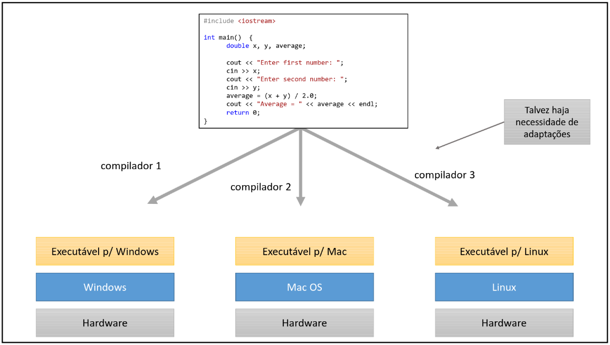
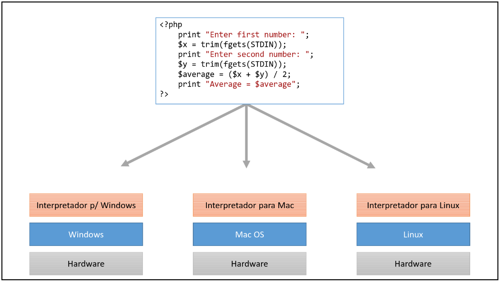
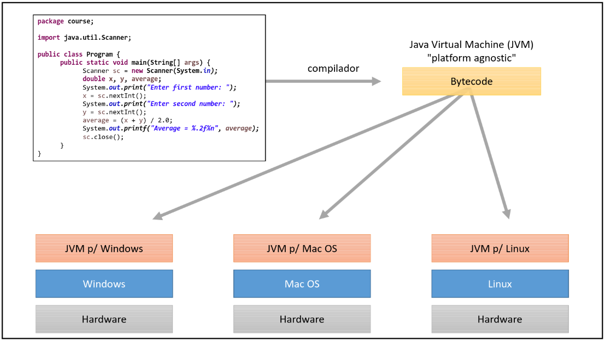
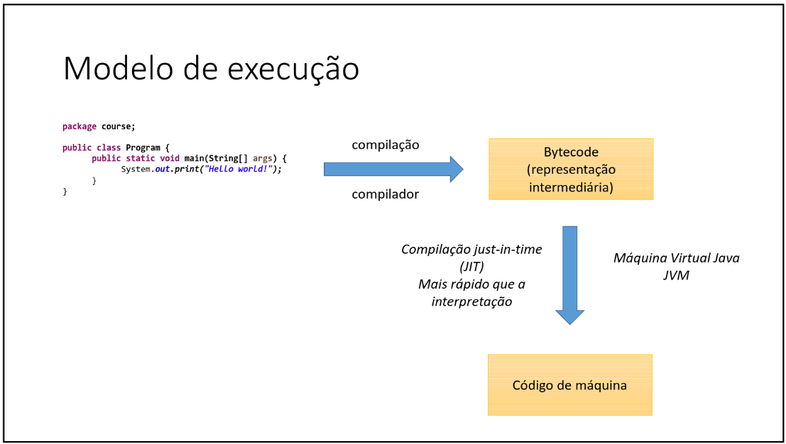

# Aula 014 - JDK / JVM - Máquina Virtual Java

## 14.1 O que é a JVM?

A JVM (Java Virtual Machine) é a Máquina Virtual do Java responsável por executar programas Java.

- É necessária tanto para executar aplicações em Java quanto para desenvolver como programador.
- Ao distribuir um programa Java, o cliente precisa ter a JVM instalada para executá-lo.

---

## 14.2 Compilação x Interpretação

### Linguagens Compiladas

- **Funcionamento:**  
  O código-fonte é processado por um compilador, que o converte diretamente em código de máquina específico para o sistema operacional e arquitetura de hardware.

- **Exemplos:** C, C++

- **Vantagens:**
  - Alta performance (executa diretamente no SO).
  - Menor sobrecarga em tempo de execução.

- **Desvantagens:**
  - Baixa portabilidade — é necessário recompilar para cada plataforma.
  - Possibilidade de ajustes manuais ao mudar de SO.

---

### Linguagens Interpretadas

- **Funcionamento:**  
  Um interpretador lê e executa o código-fonte linha a linha em tempo de execução.

- **Exemplos:** PHP, JavaScript

- **Vantagens:**
  - Alta portabilidade — o mesmo código pode rodar em múltiplas plataformas sem recompilação.

- **Desvantagens:**
  - Execução mais lenta (processamento ocorre durante a execução).
  - Tipagem mais flexível, podendo gerar mais erros se não houver cuidado.

---

## 14.3 Abordagem Híbrida do Java

O Java combina características de compilação e interpretação:

1. **Compilação:**  
   O código-fonte `.java` é compilado pelo `javac` para **bytecode** (`.class`), uma representação intermediária independente de plataforma.

2. **Execução:**  
   O bytecode é executado por uma JVM específica para o sistema operacional (Windows, macOS, Linux, etc.).

- **Vantagens do modelo híbrido:**
  - Verificação antecipada de erros de tipos e sintaxe.
  - Portabilidade: o mesmo bytecode roda em qualquer JVM compatível.
  - Otimização: execução mais rápida que linguagens puramente interpretadas, graças ao bytecode pré-processado e à compilação **JIT (Just-In-Time)**.

---

## 14.4 Papel do JDK e JRE

- **JDK (Java Development Kit):**  
  Conjunto de ferramentas para desenvolvimento Java, incluindo:
  - Compilador (`javac`)
  - Bibliotecas padrão
  - Utilitários
  - O JRE

- **JRE (Java Runtime Environment):**  
  Ambiente necessário para executar programas Java. Contém:
  - A JVM
  - Bibliotecas essenciais

---

## 14.5 Fluxo de Execução

O processo de execução de um programa Java segue as etapas abaixo:

1. **Código-Fonte (.java)**
   - O programador escreve o código-fonte em Java (`.java`), como no exemplo mostrado à esquerda da figura.
   - Esse código é legível para humanos, mas não para o computador.

2. **Compilação para Bytecode**
   - O compilador Java (`javac`) analisa o código-fonte, verifica erros de sintaxe e tipagem e, se estiver tudo correto, converte o `.java` em **bytecode** (`.class`).
   - O **bytecode** é uma representação intermediária, independente do sistema operacional.

3. **Carregamento na JVM**
   - O bytecode é carregado pela **Java Virtual Machine (JVM)** específica para a plataforma (Windows, Linux, macOS, etc.).
   - A JVM é responsável por interpretar ou compilar dinamicamente esse bytecode para código de máquina.

4. **Compilação Just-In-Time (JIT)**
   - Em vez de interpretar todo o bytecode linha a linha, a JVM utiliza o compilador **JIT (Just-In-Time)** para converter partes do bytecode em **código de máquina** durante a execução.
   - Isso aumenta a velocidade, pois o código gerado já pode ser executado diretamente pelo processador.

5. **Execução como Código de Máquina**
   - O **código de máquina** é o formato final compreendido pelo processador e executado pelo sistema operacional.
   - Nesse ponto, o programa Java realiza suas operações e interage com recursos do computador.
