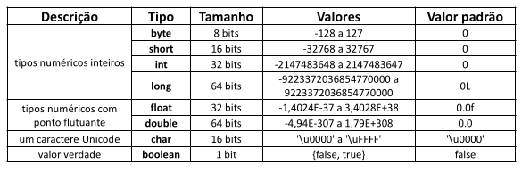

# Aula 022 – Variáveis e Tipos Básicos em Java

Um programa de computador em execução lida com **dados**. Estes dados são armazenados em **variáveis**.

## 22.1 Variáveis
- **Definição**: Porções de memória RAM usadas para armazenar dados temporários durante a execução de programas.
- O computador aloca uma quantidade de memória para programas em execução, onde as variáveis são armazenadas.

## 22.2 Declaração de Variáveis
- Em Java, para declarar uma variável, usamos a sintaxe:
```java
<tipo> <nome> = <valor inicial>;
```

- Exemplos:
```java
int idade = 25;
double altura = 1.68;
char sexo = 'F';
```

## 22.3 Componentes de uma Variável
- **Nome ou Identificador**: Ex.: `idade`, `altura`, `sexo`.
- **Tipo**: Ex.: `int` (inteiro), `double` (ponto flutuante), `char` (caractere).
- **Valor**: Ex.: `25`, `1.68`, `'F'`.
- **Endereço**: Local na memória onde o dado está armazenado (conceito avançado, não explorado no início do curso).

## 22.4 Tipos Primitivos em Java
- Java possui **8 tipos primitivos**, divididos em categorias:



## 22.5 Tipo Especial: String
- **String**: É um tipo especial `(não primitivo)` usado para representar uma cadeia de caracteres.

- Exemplo:
```java
String nome = "Maria";
```

## 22.6 Unicode em Java
- Em Java, os caracteres são baseados na codificação ****Unicode**, um padrão universal para representar caracteres de praticamente quase todos os sistemas de escrita do mundo.
- Para descobrir o **código Unicode** de um caractere específico, é possível acessar: [Ver tabela](http://evaristoandjava.blogspot.com/2011/10/tabela-unicode.html)
- **Exemplo**: O caractere `'a'` corresponde ao código Unicode `\u0061`.

## 22.7 Capacidade de Armazenamento de Bits
- A quantidade de bits disponíveis em um tipo de dado determina a quantidade de valores diferentes que ele pode armazenar.  
- Fórmula: `2^n`valores diferentes, onde **n** é o número de bits.
- Exemplo:
  - **8 bits**: `2^8 = 256` valores possíveis.
  - Para inteiros com **sinal**, **metade é para negativos** e **metade para positivos**: `-128 a 127`.

## 22.8 Regras para Nome de Variáveis em Java
- Não pode começar com dígito (`1idade` ❌).
- Não pode conter espaços em branco (`idade aluno` ❌).
- Evitar acentos e caracteres especiais (`salário` ❌).
- Recomendação: **Camel case** → primeira palavra em minúsculo, a cada nova palavra inicia com maiúscula. Ex.: `idadeAluno`

Errado | Correto
---|---
int 5minutos; | int _5minutos;
int salário; | int salario;
int salario do funcionario; | int salarioDoFuncionario;
