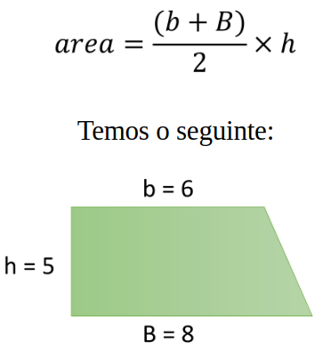

# Aula 025 – Processamento de Dados em Java e Casting

Nesta aula, aprendemos sobre **processamento de dados em Java** por meio do **comando de atribuição**, além do conceito de **casting (conversão de tipos)**.

---

## 25.1. Comando de Atribuição

O processamento de dados em Java é realizado pelo **comando de atribuição**:

**Sintaxe:**
```
<variável> = <expressão>;
```

- O lado **direito** da igualdade é avaliado (a expressão é calculada).  
- O resultado é então **armazenado** na variável do lado **esquerdo**.  

### Exemplo:
```java
int x, y;

// <variável> = <expressão>;
x = 5;
y = 2 * x;

System.out.println(x); // 5
System.out.println(y); // 10
```

Algoritmo desse Exemplo: [Ver Algoritmo](../../../workspace/aula025_exemplo01_atribuicao/src/Main.java)

---

## 25.2. Uso com Tipos Diferentes

Se `y` for do tipo `double`, o resultado da expressão também é convertido:

```java
int x = 5;
double y = 2 * x;

System.out.println(x); // 5
System.out.println(y); // 10.0
```

O `.0` aparece no valor de `y`, porque `y` é um número de ponto flutuante.

Algoritmo desse Exemplo: [Ver Algoritmo](../../../workspace/aula025_exemplo02_tipos_diferentes/src/Main.java)

---

## 25.3. Exemplo Prático – Área de um Trapézio

A fórmula da área do trapézio é:



### Código:
```java
double b = 6.0;  // base menor
double B = 8.0;  // base maior
double h = 5.0;  // altura
double area;

area = (b + B) / 2.0 * h;

System.out.println(area); // 35.0
```

**Boa prática:** sempre especifique o tipo do número:  
- Para `double`: utilize `.0`  
- Para `float`: utilize `f` no final do número  

Algoritmo desse Exemplo: [Ver Algoritmo](../../../workspace/aula025_exemplo03_area_trapezio/src/Main.java)

---

## 25.4. Cuidado com a Divisão entre Inteiros

Se ambos os operandos forem `int`, mesmo que o resultado correto seja decimal, a divisão resultará em **inteiro** (as casas decimais serão descartadas).

```java
int a = 5;
int b = 2;
double result;

result = a / b;
System.out.println(result); // 2.0
```

O resultado esperado seria `2.5`, mas o compilador interpreta `a / b` como divisão inteira, resultando em `2.0`.

Algoritmo desse Exemplo: [Ver Algoritmo](../../../workspace/aula025_exemplo04_divisao_entre_inteiros/src/Main.java)

---

## 25.5. Casting Explícito

Para obter o resultado correto da divisão entre inteiros, usamos o **casting** (conversão de tipos):

```java
int a = 5;
int b = 2;
double result;

result = (double) a / b;
System.out.println(result); // 2.5
```

O `(double)` antes da variável `a` indica ao compilador que o cálculo deve ser feito em ponto flutuante.

Algoritmo desse Exemplo: [Ver Algoritmo](../../../workspace/aula025_exemplo05_casting_explicito/src/Main.java)

---

## 25.6. Perda de Informação com Casting

Se tentarmos atribuir um `double` a uma variável `int`, ocorre **erro de compilação**, pois pode haver **perda de informação** (já que `double` armazena mais informações que `int`).

### Código que gera erro:
```java
double a = 5.0;
int b;

b = a; // ERRO: incompatible types
```

Para realizar a conversão, precisa informar explicitamente ao compilador que você está ciente da perda de dados. Isso é feito com um `cast` 

### Solução com casting:
```java
double a = 5.0;
int b;

b = (int) a; // conversão explícita
System.out.println(b); // 5
```

⚠️ O valor decimal é descartado. Exemplo: `(int) 5.9` resulta em `5`.

Algoritmo desse Exemplo: [Ver Algoritmo](../../../workspace/aula025_exemplo06_casting_perda_de_informacao/src/Main.java)

---

## 25.7. Resumo da Aula

- O **comando de atribuição** armazena em uma variável o resultado de uma expressão.  
- **Divisão entre inteiros** descarta casas decimais.  
- **Casting explícito** `(tipo) valor` é usado para forçar a conversão de tipos.  
- Pode haver **perda de informação** ao converter tipo de “maior alcance” para “menor” (ex.: de `double` para `int`).  
- É **boa prática** indicar o tipo: `.0` para `double`, `f` para `float`.  
