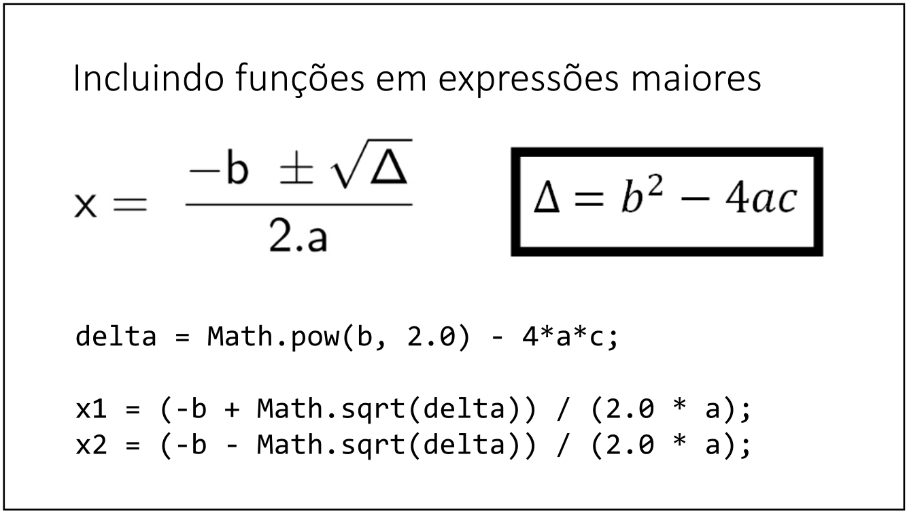

# Aula 028 - Funções Matemáticas em Java

Nesta aula vamos aprender algumas funções matemáticas disponíveis na linguagem Java, fornecidas pela classe `Math`.  

Essas funções permitem realizar operações como **raiz quadrada**, **potenciação** e **valor absoluto**.

---

## 28.1 Classe Math
- A classe `Math` é padrão da linguagem Java (pertencente ao pacote `java.lang`, importado automaticamente) e fornece métodos estáticos para cálculos matemáticos.
- Não é necessário instanciar um objeto da classe; basta chamar diretamente os métodos, como `Math.sqrt(x)`

---

## 28.2 Algumas Funções Matemáticas

| Função | Exemplo de Uso | Descrição |
|--------|----------------|-----------|
| `Math.sqrt(x)` | `double A = Math.sqrt(x);` | Retorna a raiz quadrada de `x`. |
| `Math.pow(x, y)` | `double A = Math.pow(x, y);` | Retorna `x` elevado à potência `y`. |
| `Math.abs(x)` | `double A = Math.abs(x);` | Retorna o valor absoluto de `x` (sem sinal). |

📌 Para mais informações consulte: [documentação oficial da classe Math](https://docs.oracle.com/javase/8/docs/api/java/lang/Math.html)

---

## 28.3 Exemplos de Código

### 28.3.1 Funções Básicas

```java
double x = 3.0;
double y = 4.0;
double z = -5.0;
double A, B, C;

// Raiz quadrada
A = Math.sqrt(x);
B = Math.sqrt(y);
C = Math.sqrt(25.0);
System.out.println("Raiz quadrada de " + x + " = " + A);
System.out.println("Raiz quadrada de " + y + " = " + B);
System.out.println("Raiz quadrada de 25 = " + C);

// Potenciação
A = Math.pow(x, y);
B = Math.pow(x, 2.0);
C = Math.pow(5.0, 2.0);
System.out.println(x + " elevado a " + y + " = " + A);
System.out.println(x + " elevado ao quadrado = " + B);
System.out.println("5 elevado ao quadrado = " + C);

// valor absoluto
A = Math.abs(y);
B = Math.abs(z);
System.out.println("O valor absoluto de " + y + " = " + A);
System.out.println("O valor absoludo de " + z + " = " + B);
```

### Saída
```
Raiz quadrada de 3.0 = 1.7320508075688772
Raiz quadrada de 4.0 = 2.0
Raiz quadrada de 25 = 5.0
3.0 elevado a 4.0 = 81.0
3.0 elevado ao quadrado = 9.0
5 elevado ao quadrado = 25.0
O valor absoluto de 4.0 = 4.0
O valor absoludo de -5.0 = 5.0
```

Algoritmo para esse exemplo: [Ver Algoritmo](../../../workspace/aula028_exemplo01_math_funcoes/src/Main.java)


### 28.3.2 Bashcaras

- Você também pode combinar essas funções dadas no exemplo anterior em fórmulas mais complexas, como a fórmula de Bhaskara para resolver equações de segundo grau:



```java
double a = 1;
double b = -3;
double c = 2;
		
double delta = Math.pow(b, 2) - 4 * a * c;
		
double x1 = (-b - Math.sqrt(delta)) / (2.0 * a);
double x2 = (-b + Math.sqrt(delta)) / (2.0 * a);
		
System.out.println("delta = " + delta);
System.out.println("As raízes da equação são:");
System.out.println("x1 = " + x1);
System.out.println("x2 = " + x2);
```

### Saída
```
delta = 1.0
As raízes da equação são:
x1 = 1.0
x2 = 2.0
```

Algoritmo para esse exemplo: [Ver Algoritmo](../../../workspace/aula028_exemplo02_bhaskara/src/Main.java)

---
