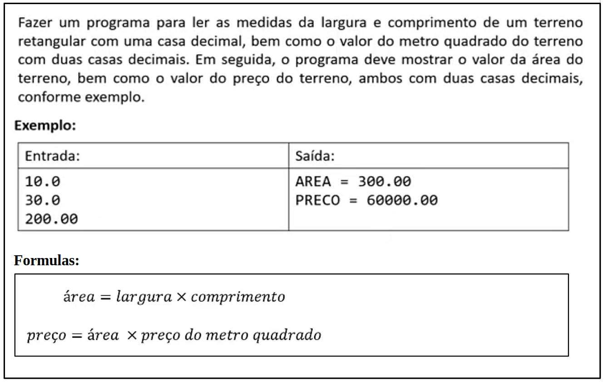
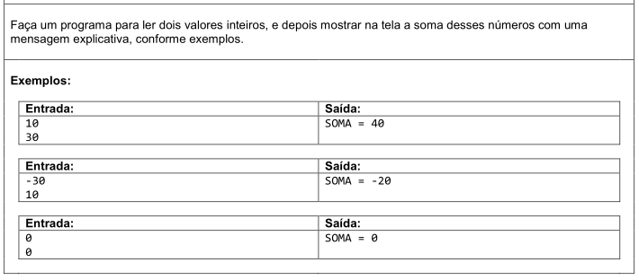
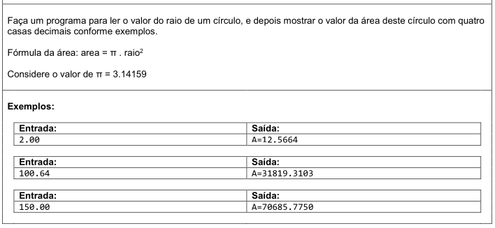
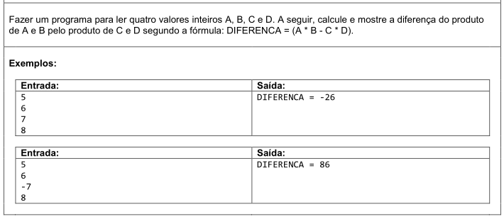
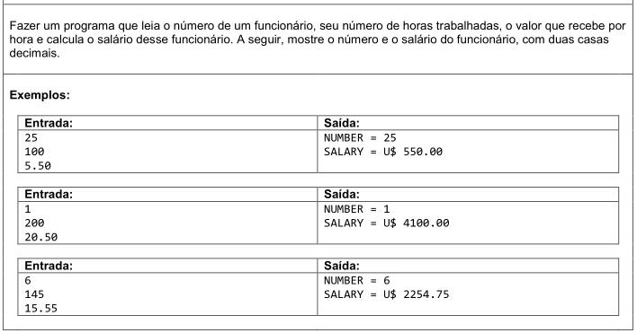
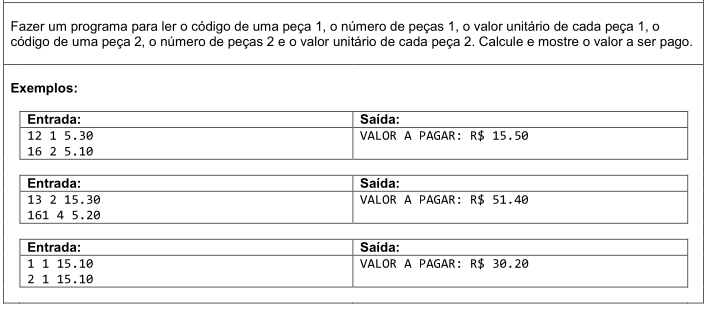
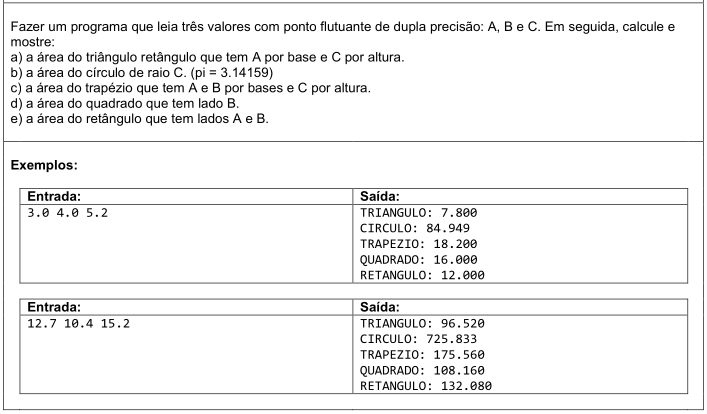

# Aula 029 - Exercícios sobre Estrutura Sequencial (Entrada, Processamento e Saída)

Já estudamos a **estrutura sequencial**, composta por:

- **Entrada de dados** → leitura de valores fornecidos pelo usuário.  
- **Processamento** → operações e atribuições realizadas pelo programa.  
- **Saída de dados** → exibição dos resultados no console.  

Agora é o momento de **praticar** esses conceitos com exercícios.

> Os exercícios foram retirados do [URI Online Judge](https://www.urionlinejudge.com.br)

### Observação
Nas implementações que realizei, foram incluídas mensagens de interação com o usuário (por exemplo, "Insira a largura do terreno:"),  
com o objetivo de tornar o programa mais didático e facilitar a execução em um ambiente de estudo.  

**⚠️ Atenção**:  
Em plataformas de correção automática (como Beecrowd/URI ou juízes online), essas mensagens extras podem gerar erro, pois a saída deve coincidir exatamente com o esperado pelo problema.

---

## 29.1 Exercício Resolvido

**Meu Algoritmo com a Resolução para esse Problema:**  
[Ver Algoritmo](../../../workspace/aula029e030_exercicio_resolvido01/src/Main.java)

Confira a aula onde esse problema é resolvido passo a passo, aplicando os conceitos de entrada, processamento e saída:  
[Ir para o Vídeo](https://www.youtube.com/watch?v=Ah1Y6d6deq0)

---

## 29.2 Exercícios Propostos

Segue o **PDF com exercícios propostos**, onde tem enunciado de cada exercício:  
[Ir para o PDF com Exercícios](../../../enunciados_dos_exercicios/lista01_exercicios_sobre_estrutura_sequencial.pdf)

- Esses exercícios devem ser resolvidos por conta própria, a prática é essencial, principalmente para iniciantes em programação.

---

### 29.2.1 Somar Inteiros

**Meu Algoritmo com a Resolução para esse Problema:**
[Ver Algoritmo](../../../workspace/aula029e030_exercicio_proposto01_somar_inteiros/src/Main.java)

---

### 29.2.2 Área do Círculo

**Meu Algoritmo com a Resolução para esse Problema:**
[Ver Algoritmo](../../../workspace/aula029e030_exercicio_proposto02_area_circulo/src/Main.java)

---

### 29.2.3 A Diferença do Produto Entre Inteiros

**Meu Algoritmo com a Resolução para esse Problema:**
[Ver Algoritmo](../../../workspace/aula029e030_exercicio_proposto03_diferenca_produto/src/Main.java)

---

### 29.2.4 Calcular Salário do Funcionário

**Meu Algoritmo com a Resolução para esse Problema:**
[Ver Algoritmo](../../../workspace/aula029e030_exercicio_proposto04_calcular_salario/src/Main.java)

---

### 29.2.5 Calcular Valor a Pagar

**Meu Algoritmo com a Resolução para esse Problema:**
[Ver Algoritmo](../../../workspace/aula029e030_exercicio_proposto05_valor_a_pagar/src/Main.java)

---

### 29.2.6 Calcular Área das Figuras Geométricas

**Meu Algoritmo com a Resolução para esse Problema:**
[Ver Algoritmo](../../../workspace/aula029e030_exercicio_proposto06_areas_geometricas/src/Main.java)
