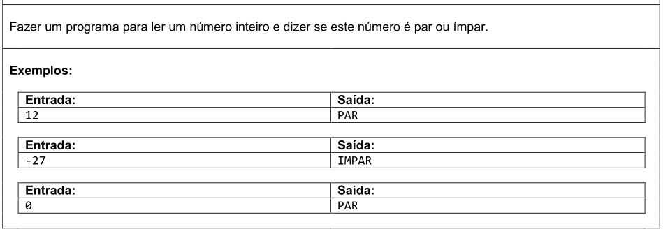
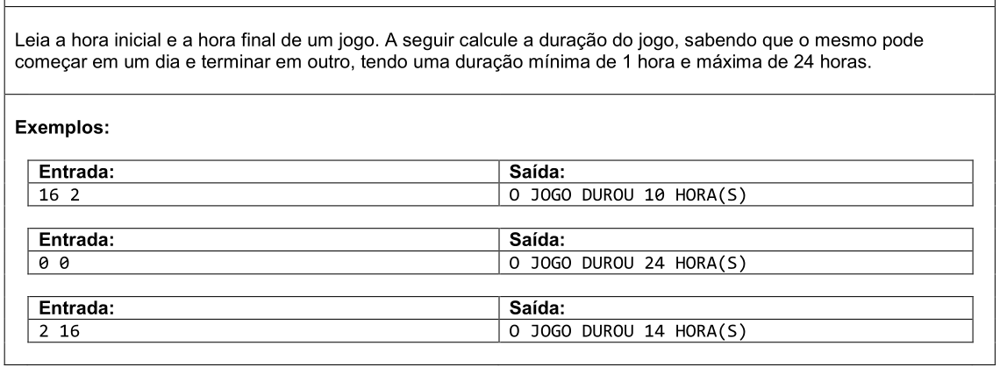

# Aula 037 - Exercícios sobre Estrutura Condicional (if-else)

Já estudamos a **estrutura condicional**, utilizada para **tomar decisões** dentro de um programa.  
Ela pode assumir diferentes formas:

- **if (simples)** → executa um bloco apenas se a condição for verdadeira.  
- **if-else** → escolhe entre duas alternativas possíveis.  
- **if-else if-else** → permite tratar múltiplas condições encadeadas.  
- **else if** → evita a criação de vários `if` aninhados, deixando o código mais limpo e legível.  

Agora é o momento de **praticar** esses conceitos com exercícios.  
Essas práticas ajudam a consolidar a habilidade de estruturar **fluxos de decisão**, tornando os programas mais flexíveis e inteligentes.

> Os exercícios desta seção foram retirados do [URI Online Judge](https://www.urionlinejudge.com.br).  

### Observação
Nos códigos apresentados a seguir, foram adicionadas **mensagens de interação com o usuário** (ex.: `"Digite um número inteiro:"`),  
a fim de tornar a execução mais didática em um ambiente de estudo.  

⚠️ **Atenção**:  
Em plataformas de correção automática (como Beecrowd/URI ou outros juízes online), essas mensagens **não devem ser incluídas**,  
pois a saída do programa precisa coincidir exatamente com o formato esperado pelo enunciado.

---

## 37.1 Exercícios Resolvidos 

### 37.1.1 Nota do Aluno (Estrutura Condicional Simples - if)

- **Meu Algoritmo com a Resolução para esse Problema:** [Ver Algoritmo](../../../workspace/aula036e037_exercicio_resolvido01_nota_do_aluno/src/Main.java)

- Confira a aula onde esse problema é resolvido passo a passo:
[Ir para o Vídeo](https://www.youtube.com/watch?v=SRyQZBaA-_s)

---

### 37.1.2 Fórmula de Bhaskara

- **Meu Algoritmo com a Resolução para esse Problema:** [Ver Algoritmo](../../../workspace/aula036e037_exercicio_resolvido02_bhaskara/src/Main.java)

- Confira a aula onde esse problema é resolvido passo a passo:
[Ir para o Vídeo](https://www.youtube.com/watch?v=3lhkB5I8P6E)

---

### 37.1.3 O Menor Número

- **Meu Algoritmo com a Resolução para esse Problema:** [Ver Algoritmo](../../../workspace/aula036e037_exercicio_resolvido03_menor_numero/src/Main.java)

- Confira a aula onde esse problema é resolvido passo a passo:
[Ir para o Vídeo](https://www.youtube.com/watch?v=UjCVIcKccdQ)

---

## 37.2 Exercícios Propostos

### 37.2.1 Número é Negativo?

- **Meu Algoritmo com a Resolução para esse Problema:** [Ver Algoritmo](../../../workspace/aula036e037_exercicio_proposto01_numero_negativo/src/Main.java)

---

### 37.2.2 Número é Par ou Ímpar

- **Meu Algoritmo com a Resolução para esse Problema:** [Ver Algoritmo](../../../workspace/aula036e037_exercicio_proposto02_par_ou_impar/src/Main.java)

---

### 37.2.3 Números são Múltiplos

- **Meu Algoritmo com a Resolução para esse Problema:** [Ver Algoritmo](../../../workspace/aula036e037_exercicio_proposto03_numeros_multiplos/src/Main.java)

---

### 37.2.4 Duração do Jogo

- **Meu Algoritmo com a Resolução para esse Problema:** [Ver Algoritmo](../../../workspace/aula036e037_exercicio_proposto04_duracao_jogo/src/Main.java)

---

### 37.2.5 Valor da Conta

- **Meu Algoritmo com a Resolução para esse Problema:** [Ver Algoritmo](../../../workspace/aula036e037_exercicio_proposto05_valor_da_conta/src/Main.java)

---

### 37.2.6 Intervalo Numérico

- **Meu Algoritmo com a Resolução para esse Problema:** [Ver Algoritmo](../../../workspace/aula036e037_exercicio_proposto06_intervalo_numerico/src/Main.java)

---

### 37.2.7 Quadrante do Ponto

- **Meu Algoritmo com a Resolução para esse Problema:** [Ver Algoritmo](../../../workspace/aula036e037_exercicio_proposto07_quadrante_do_ponto/src/Main.java)

---

### 37.2.8 Imposto de Renda

- **Meu Algoritmo com a Resolução para esse Problema:** [Ver Algoritmo](../../../workspace/aula036e037_exercicio_proposto08_imposto_renda/src/Main.java)
