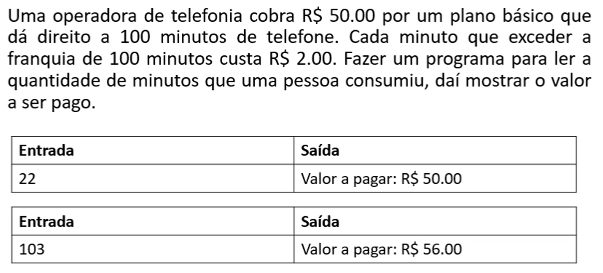

# Aula 038 - Operadores de Atribuição Cumulativa

Além das estruturas condicionais que já estudamos, existe uma **sintaxe opcional** muito usada em Java:  
os **operadores de atribuição cumulativa**.  

Eles tornam o código mais **enxuto e direto**, eliminando repetições desnecessárias.

---

## 38.1 O que são Operadores de Atribuição Cumulativa?

Os **operadores de atribuição cumulativa** são formas **abreviadas** de atualizar o valor de uma variável, aplicando nela mesma uma operação aritmética.  

Em vez de escrever:
```java
a = a + b;
```

podemos usar:
```java
a += b;
```

O resultado final é o mesmo, mas o código fica mais compacto.

---

## 38.2 Tabela de Equivalência

O efeito é exatamente o mesmo, mas com uma notação mais curta.

| Forma abreviada | Equivalência completa | Significado                                          |
| --------------- | --------------------- | ---------------------------------------------------- |
| `a += b;`       | `a = a + b;`          | Soma `b` ao valor de `a` e atualiza `a`                          |
| `a -= b;`       | `a = a - b;`          | Subtrai `b` do valor de `a` e atualiza `a`                        |
| `a *= b;`       | `a = a * b;`          | Multiplica `a` por `b` e atualiza `a`                   |
| `a /= b;`       | `a = a / b;`          | Divide `a` por `b` e atualiza `a`                        |
| `a %= b;`       | `a = a % b;`          | Calcula o resto da divisão de `a` por `b` e atualiza `a`|

---

## 38.3 Exemplo Prático

```java
int x = 10;

x += 5;  // x = 15
x -= 3;  // x = 12
x *= 2;  // x = 24
x /= 4;  // x = 6
x %= 5;  // x = 1
```

Assim, os operadores cumulativos são especialmente úteis quando **a nova atribuição depende do valor atual da variável.**

---

## 38.4 Problema Prático: Plano de Telefonia



- **Meu Algoritmo com a Resolução para esse Problema:** [Ver Algoritmo](../../../workspace/aula038_problema01_plano_telefonia/src/Main.java)
