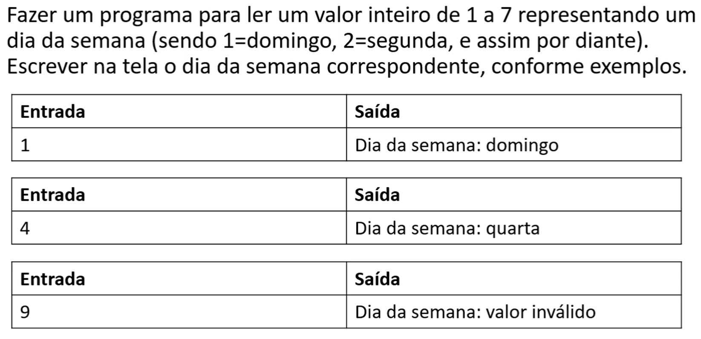

# Aula 039 - Estrutura Switch Case

Além do uso de estruturas condicionais encadeadas com `if/else if`, o Java fornece uma **sintaxe alternativa** chamada `switch`, muito útil quando precisamos tratar **várias opções de fluxo** com base no valor de uma mesma variável.

Essa estrutura torna o código mais **claro e organizado**, evitando uma cadeia extensa de condicionais.

---

## 39.1 O que é o switch?

O `switch` avalia o valor de uma expressão (geralmente uma variável) e direciona o fluxo para o **bloco de código correspondente ao valor encontrado**.

- Cada opção é definida por um `case`.

- Após executar um `case`, é necessário usar a palavra-chave `break` para encerrar a execução naquele ponto.

- Caso nenhum valor seja correspondente, o `default` é acionado, funcionando como um “else final”.

---

## 39.2 Estrutura Geral

```java
switch (expressao) {
    case valor1:
        // comandos executados se expressao == valor1
        break;
    case valor2:
        // comandos executados se expressao == valor2
        break;
    ...
    default:
        // comandos executados se nenhum caso for atendido
}
```

---

## 39.3 Problema Prático: Dia da Semana



- **Meu Algoritmo com a Resolução para esse Problema:** [Ver Algoritmo](../../../workspace/aula039_switch_case_problema01_dia_semana/src/Main.java)
