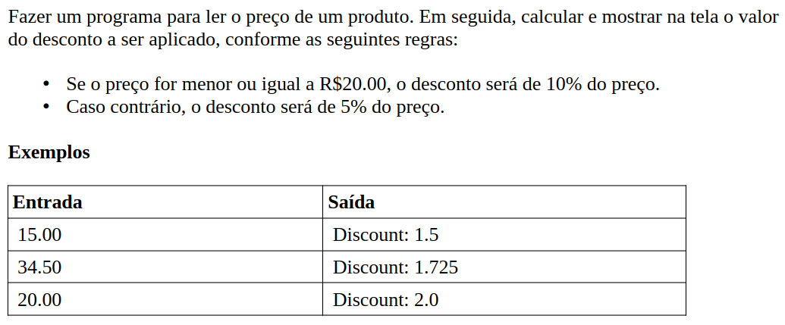

# Aula 040 - Expressão Condicional Ternária

Nesta aula estudamos a **expressão condicional ternária**, uma forma alternativa de simplificar decisões condicionais quando precisamos **atribuir um valor com base em uma condição**.

Ela torna o código mais **curto e direto**, substituindo estruturas **if/else** simples.

---

## 40.1 O que é a Expressão Ternária?

A expressão condicional ternária segue a seguinte sintaxe:

```java
condicao ? valor_se_verdadeiro : valor_se_falso
```

- A **condição** é avaliada (resultado **true** ou **false**).
- Se for **verdadeira**, o resultado da expressão será `valor_se_verdadeiro`.
- Caso contrário, o resultado será `valor_se_falso`.

---

## 40.2 Exemplos Simples

```java
int result = (2 > 4) ? 50 : 80;
// 2 > 4 é falso → result recebe 80
```

```java
String name = (10 != 3) ? "Maria" : "Alex";
// 10 != 3 é verdadeiro → name recebe "Maria"
```

> Perceba que em apenas **uma linha** conseguimos atribuir valores condicionais.

---

## 40.3 Exemplo Prático: if/else vs. Expressão Ternária

### 40.3.1 Usando if/else

```java
double price = 34.5;
double discount;

if (price <= 20.0) {
    discount = price * 0.1;
} else {
    discount = price * 0.05;
}

System.out.println("Discount: " + discount);
```

### 40.3.2 Usando Expressão Ternária

```java
double price = 34.5;
double discount = (price <= 20.0) ? price * 0.1 : price * 0.05;

System.out.println("Discount: " + discount);
```

> As duas versões produzem o mesmo resultado, mas a versão com **expressão ternária** é mais **enxuta e legível** quando a lógica condicional é simples.

---

## 40.4 Benefícios do Uso

- Evita repetição de código.
- Deixa expressões condicionais mais compactas.
- Permite atribuições diretas de valores.

⚠️ Entretanto, para condições mais **complexas**, ainda é recomendável usar estruturas **if/else**, pois a legibilidade pode ser prejudicada.

---

## 40.5 Problema Prático: Desconto em Produto



- **Meu Algoritmo com a Resolução para esse Problema:** [Ver Algoritmo](../../../workspace/aula040_problema01_desconto_produto/src/Main.java)