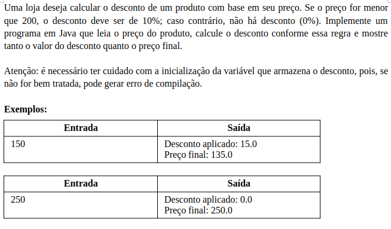

# Aula 041 - Escopo e Inicialização

Nesta aula estudamos os conceitos de **escopo** e **inicialização de variáveis** em Java, entendendo onde uma variável pode ser acessada e por que é obrigatório atribuir um valor a ela antes de utilizá-la.

---

## 41.1 Escopo de Variáveis

O **escopo** de uma variável é a região do programa onde ela pode ser **acessada**.
- Variáveis **declaradas** dentro de **estruturas de controle** (ex.: `if`, `for`, `while`) só existem dentro desse bloco.
- Quando a **execução da estrutura termina**, as variáveis declaradas dentro dela são **removidas da memória**.

### 41.1.1 Exemplo
```java
public class EscopoExemplo {
    public static void main(String[] args) {
        int preco = 400; // variável declarada no escopo do método main
        System.out.println(preco); // válido

        if (preco < 200) {
            double desconto = preco * 0.1; // variável declarada no escopo do if
            System.out.println("Desconto: " + desconto);
        }

        // System.out.println(desconto); // ERRO
    }
}
```
- **Explicação do ERRO**:
A variável `desconto` foi declarada **dentro do bloco `if`**, então seu escopo é limitado a esse bloco. **Ela não existe fora dele**, por isso o **erro** ao tentar acessá-la fora do `if`.

---

## 41.2 Inicialização de Variáveis

Em Java, **toda variável local precisa ser inicializada antes do uso**.
Caso contrário, o **compilador gera erro**.

### 41.2.1 Exemplo de Erro (não inicializada)

```java
public class Inicializacao {
    public static void main(String[] args) {
        int preco; // variável declarada, mas não inicializada
        // System.out.println(preco); // ERRO
    }
}
```
- **Explicação do ERRO**:
Quando uma **variável local não é inicializada**, o compilador não sabe qual valor ela contém, resultando em um **erro de compilação**. O código falha ao tentar acessar o valor de `preco`, pois ele não foi atribuído.

### 41.2.2 Exemplo com Erro Corrigido

```java
public class Inicializacao {
    public static void main(String[] args) {
        int preco = 400; // variável inicializada
        System.out.println(preco); // agora funciona
    }
}
```
- **Explicação**:
Agora que a variável `preco` foi **inicializada** com o valor 400, ela pode ser utilizada sem problemas, e o programa compilará e executará corretamente.

---

## 41.3 Escopo + Inicialização em Estruturas Condicionais

**Erro comum**: Declarar uma variável **fora de um bloco condicional (como um `if`)** e **inicializá-la apenas dentro desse bloco**. O compilador acusará **erro** porque **nem sempre a condição será verdadeira**, e a variável pode não ser inicializada.

### 41.3.1 Exemplo de erro

```java
public class Desconto {
    public static void main(String[] args) {
        int preco = 400;
        double desconto; // declarada fora do if, mas não inicializada

        if (preco < 200) {
            desconto = preco * 0.1; // só vai inicializar, se entrar no if
        }

        // ERRO: variável pode não ter sido inicializada
        System.out.println("Desconto: " + desconto);
    }
}
```
- **Explicação do erro**:
Neste exemplo, a variável `desconto` é **declarada fora do bloco** `if`, mas sua **inicialização só ocorre dentro do `if`**. Caso a condição `preco < 200` seja **falsa**, a variável **nunca será inicializada**, o que gera um **erro de compilação**. O compilador não pode **garantir** que a variável tenha um valor válido.


### 41.3.2 Solução 1: Inicializar a variável com valor padrão
```java
public class Desconto {
    public static void main(String[] args) {
        int preco = 400;
        double desconto = 0.0; // inicializada com valor padrão

        if (preco < 200) {
            desconto = preco * 0.1;
        }

        System.out.println("Desconto: " + desconto); // sem erro
    }
}
```
- **Explicação da Solução**:
A variável `desconto` **é inicializada com um valor padrão (0.0)** no momento da declaração. Isso garante que, **independentemente da condição do if**, a variável tenha sempre um **valor válido**, **evitando o erro de compilação**.

### 41.3.3 Solução 2: Usar else para garantir inicialização
```java
public class Desconto {
    public static void main(String[] args) {
        int preco = 400;
        double desconto; // variável declarada, mas não inicializada

        if (preco < 200) {
            desconto = preco * 0.1; // inicializa se a condição for verdadeira
        } else {
            desconto = 0.0; // inicializa caso a condição seja falsa
        }

        System.out.println("Desconto: " + desconto); // sem erro
    }
}
```
- **Explicação da Solução**:
O `else` **garante** que, se a condição do `if` não for atendida, a **variável ainda será inicializada com um valor** (0.0 neste caso). Isso resolve o problema de inicialização.

---

## 41.4 Resumo
**Escopo:**
- Variáveis só podem ser acessadas dentro do **bloco** onde foram declaradas.

**Inicialização:**
- **Variáveis locais precisam ser inicializadas antes de serem utilizadas**.
- O compilador verifica se uma variável foi **inicializada**, e gerará um **erro** caso haja a possibilidade de **usá-la sem valor atribuído**.

**Estruturas de Controle:**
- Blocos como `if`, `for`, `while` possuem **escopos próprios**.
- Variáveis declaradas **dentro desses blocos** só existem enquanto o bloco estiver sendo executado. Ao sair do bloco, elas **deixam de existir**.

O compilador do Java realiza uma análise de fluxo de dados para garantir que todas as variáveis locais tenham sido inicializadas antes de qualquer uso. Essa verificação ocorre em tempo de compilação, não em tempo de execução.

---

## 41.5 Problema Prático: Cálculo de Desconto e Inicialização



- **Meu Algoritmo com a Resolução para esse Problema:** [ Ver Algoritmo](../../../workspace/aula041_problema01_calculo_desconto/src/Main.java)