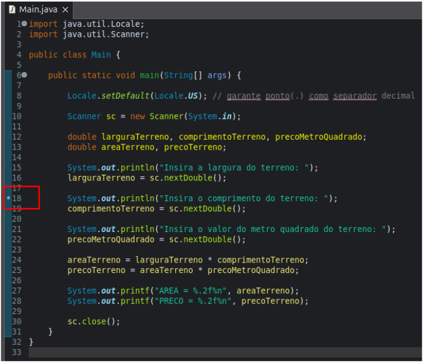
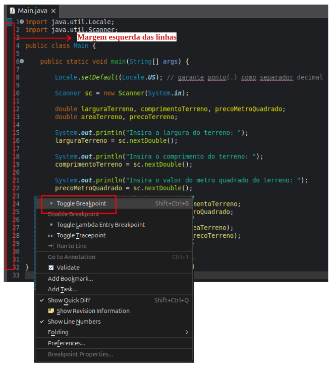
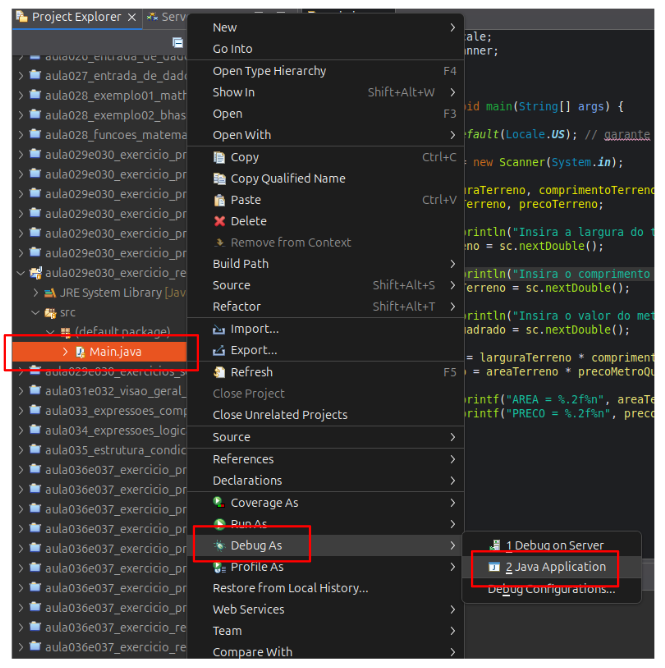
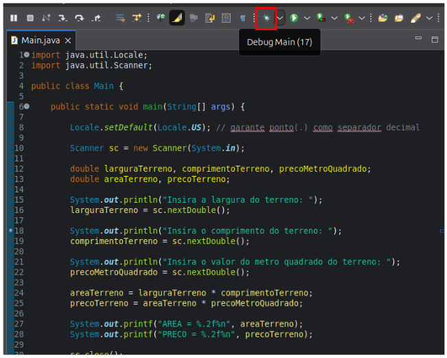
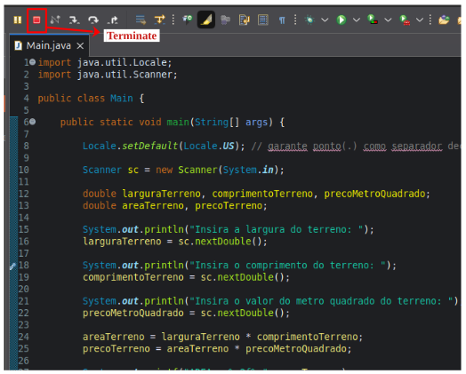
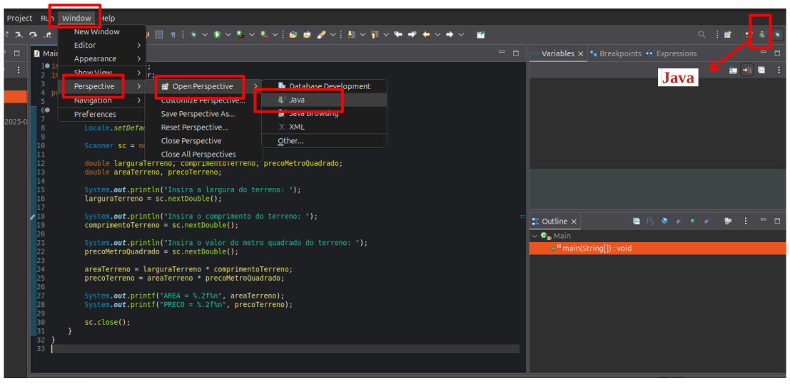

# Aula 044 - Como Utilizar o Debug no Eclipse

No processo de desenvolvimento de software, **identificar e corrigir erros** de maneira eficiente é essencial para garantir que o programa funcione corretamente. Por isso, é importante saber usar o **debug (depurador)** do Eclipse, que permite **executar o programa passo a passo**, acompanhar o **valor das variáveis em tempo real** e **identificar erros** de forma precisa e rápida.

---

## 44.1 Conceito de Debug

O **debug** permite executar o programa **linha por linha**, de forma **controlada**, para observar seu comportamento em tempo real. Com ele, é possível:

- Acompanhar o **fluxo de execução**, entendendo a ordem em que as instruções são processadas;
- Verificar o **valor das variáveis** em cada etapa da execução, ajudando a identificar inconsistências;
- **Interromper** a execução em pontos específicos, facilitando a análise do estado do programa;
- Facilitar a **detecção e correção de erros**, tornando o processo de depuração mais preciso e eficiente.

---

## 44.2 Breakpoints (Pontos de Parada)

- Um **breakpoint** indica **onde a execução será interrompida** para iniciar o modo de depuração.  
- Ele **interrompe a execução em um ponto específico**, permitindo a análise do comportamento do código, sem que o programa siga rodando sem interrupções até o fim.

### 44.2.1 Exemplo

O programa terá sua execução normalmente até chegar na **linha 18** que possui o **breakpoint** (onde tem essa bolinha), a partir daí o programa é executado de **forma controlada**.

### 44.2.1 Como Adicionar um Breakpoint:

**1. Clique rápido duas vezes** na **margem esquerda** da linha desejada, onde você quer que a execução seja interrompida.  
**2.** Ou clique com o **botão direito** na **margem esquerda** da linha e selecione `Toggle Breakpoint`.  
**3.** Ou pode usar o atalho `Ctrl + Shift + B` para adicionar o **breakpoint**.

- Uma **bolinha** aparecerá na **margem esquerda da linha**, indicando que o **breakpoint** foi adicionado.
- Para **remover** o breakpoint, basta repetir os mesmos passos ou usar o atalho novamente.

---

## 44.3 Iniciando o Debug

Após adicionar o **BreakPoint** na linha desejada, siga os passos abaixo para iniciar o processo de depuração:

**1.** Clique com o **botão direito** na classe principal (por exemplo, `Main.java`).  
**2.** Selecione a opção `Debug As` → `Java Application`.

3. Quando a execução chegar no **BreakPoint**, o Eclipse perguntará se você quer mudar para a **perspectiva de Debug** → escolha **Switch** (Trocar).  

A **perspectiva de Debug** reorganiza o layout do Eclipse, mostrando painéis específicos:

- **Editor**: Exibe a linha atual de execução destacada.
- **Variables**: Mostra os valores das variáveis em tempo real.
- **Console**: Exibe a entrada e saída do programa, facilitando a leitura de mensagens e erros.
- Outros painéis úteis podem ser exibidos dependendo da configuração.

**OBS:** Outra forma de iniciar o Debug é, após adicionar o **BreakPoint**, clicar no ícone do **debug** na barra de ferramentas do Eclipse:

---

## 44.4 Execução Passo a Passo

Durante o processo de depuração, o programa **interrompe a execução** na linha marcada pelo breakpoint. A partir daí, você pode avançar **passo a passo**, executando o código **linha por linha** para analisar seu comportamento.

### 44.4.1 Comandos e Atalhos

| Ação          | Descrição                                         | Atalho      |
| ------------- | ------------------------------------------------- | ----------- |
| **Step Over** | Executa a **próxima linha** do código.            | `F6`        |
| **Resume**    | Continua a execução até o **próximo breakpoint**. | `F8`        |
| **Terminate** | **Interrompe** a execução do debug.               | `Ctrl + F2` |

- **Step Into (`F5`)**: Avança para dentro de um método ou função chamado, permitindo analisar o código detalhadamente. Diferente do `Step Over` (`F6`), que executa o método sem entrar nele.

    - Dica: Use o `Step Into` (`F5`) quando for necessário depurar **métodos que você mesmo criou**. Não é necessário usá-lo em métodos da própria linguagem ou bibliotecas externas.

---

## 44.5 Encerrando a Depuração

- Para **finalizar** o debug, clique no **ícone quadrado (Terminate)**.

- Para **voltar à perspectiva Java**, tem duas opções:
    - Use o botão da **perspectiva “Java”** no canto superior direito, ou
    - Ou vá até o menu: `Window` → `Perspective` → `Open Perspective` → `Java`.

---

## 44.6 Dicas Importantes

- Você pode **adicionar ou remover breakpoints a qualquer momento**.
- É possível **interromper a execução a qualquer instante**.
- Use o debug especialmente quando:
    - O programa **não se comporta como esperado**;
    - Você precisa **verificar valores intermediários** de variáveis;
    - Há **exceções ou erros lógicos difíceis de rastrear**.

O **debug é uma das ferramentas mais poderosas do Eclipse**.
Ele permite entender o que o código **realmente faz**, e não apenas o que você **acha que faz**.
Dominar seu uso é essencial para um bom programador, pois ajuda a **analisar, corrigir e otimizar** programas de forma precisa.