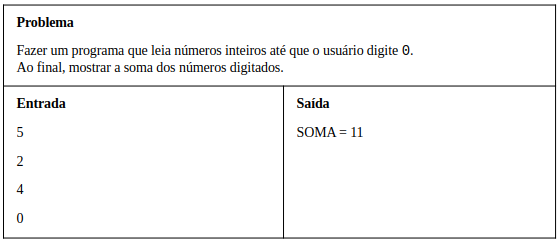

# Aula 045 - Estrutura Repetitiva while

Nesta aula estudamos a **estrutura de repetição `while`**, que permite executar um **bloco de comandos repetidamente enquanto uma condição for verdadeira**.

Ela é amplamente utilizada **quando não se sabe previamente o número de repetições** que o programa deve executar.

---

## 45.1 Conceito e Funcionamento

A estrutura `while` é uma **estrutura de controle de fluxo** que verifica uma **condição lógica** antes de cada repetição do bloco de comandos.

Se a condição for **verdadeira**, o bloco é **executado**;
se for **falsa**, o programa **sai do laço** e segue a execução normal.

Sintaxe:
```java
while (condicao) {
    // comandos a serem repetidos
}
```

**Diferença para o `if`**:

- O `if` **testa uma condição uma única vez**.
- O `while` **testa repetidamente** e **retorna ao início** do bloco enquanto a condição continuar verdadeira.

---

## 45.2 Quando Usar o while

Utilize `while` quando **não se sabe antecipadamente** quantas vezes o bloco de código deve ser executado.
**Exemplo:**
Um programa que **lê números até que o usuário digite 0**.

Em pseudocódigo, o raciocínio ficaria assim:
```text
leia num
enquanto num for diferente de 0:
    faça algo (por exemplo, somar)
    leia num novamente
```

Nesse tipo de situação, o programa **não tem um número fixo de repetições** - ele depende de uma condição de parada definida pelo usuário (neste caso, digitar o número 0).

---

## 45.3 Exemplo: Soma de Números até Digitar Zero



Lógica do problema:

- O programa lê um número `x`.
- Enquanto `x` for diferente de `0`, ele continua lendo novos números e acumulando a soma.
- Quando `x` for `0`, o laço termina e o resultado é mostrado.

**Meu Algoritmo com a Resolução para esse Problema:** [ Ver Algoritmo](../../../workspace/aula045_while_exemplo01_soma/src/Main.java)

---

## 45.4 Observações Importantes

- Sempre inicialize as variáveis antes do laço.
- A leitura inicial fora do `while` é necessária para que haja um primeiro valor a ser testado.
- Use o `while` apenas quando a quantidade de repetições **não for conhecida previamente**.
- Se a condição for **falsa na primeira verificação**, o bloco **não será executado nenhuma vez**.
- Execute usando o **Debug** para entender melhor como funciona o `while`. (Qualquer dúvida sobre Debug, ver [Aula 044](../aula044_utilizacao_debug_no_eclipse/aula044_como_utilizar_debug_no_eclipse.md))
    - Coloque um **breakpoint** na linha do while.  
    - Execute com **Debug As** → **Java Application**.  
    - Observe as variáveis `x` e `soma` mudando na aba Variables a cada iteração.

---

## 45.5 Resumo

| Conceito    | Descrição                                                                           |
| ----------- | ----------------------------------------------------------------------------------- |
| Estrutura   | `while (condição) { comandos }`                                                     |
| Tipo        | Estrutura de repetição                                                              |
| Condição    | Avaliada **antes** de cada execução                                                 |
| Uso comum   | Quando **não se sabe** o número de repetições                                       |
| Regra geral | Se condição **verdadeira** → executa e volta<br>Se condição **falsa** → sai do laço |
