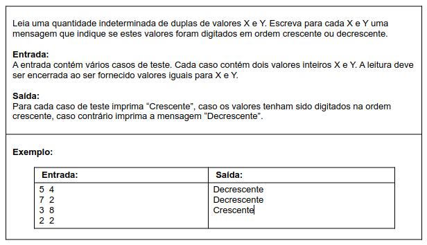
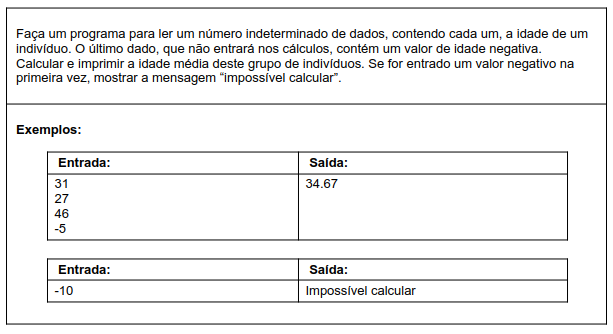
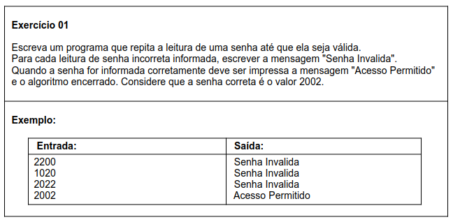
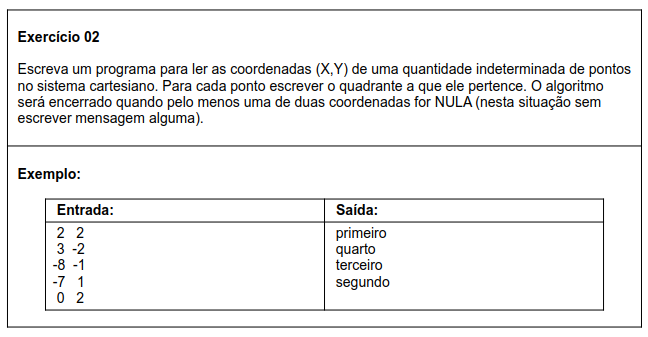
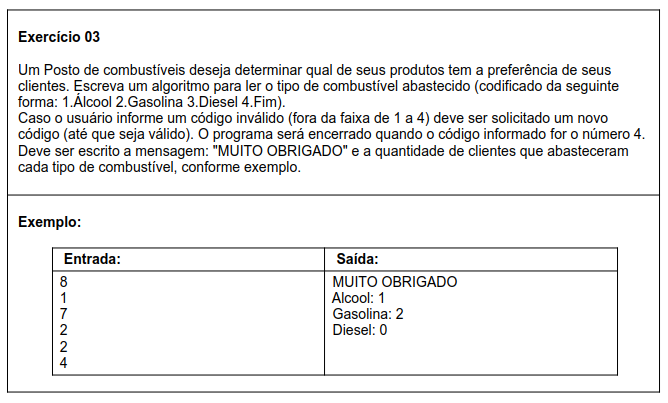

# Aula 054 e 055 – Exercícios sobre Estrutura Repetitiva while

Nesta etapa do curso, estudamos a **estrutura repetitiva** `while`, utilizada quando:

- Não sabemos previamente o número exato de repetições
- A repetição depende de uma condição lógica
- O bloco de código é executado enquanto a condição for verdadeira

De forma geral, a estrutura funciona assim:

- Inicialização → definição das variáveis de controle
- Teste da condição → verificação antes de cada iteração
- Execução do bloco → comandos dentro do while
- Atualização → modificação das variáveis que controlam a repetição

Agora é o momento de praticar esses conceitos com exercícios.

> Os exercícios foram retirados do [Beecrowd](https://www.urionlinejudge.com.br) (antigo URI Online Judge), conforme utilizado pelo professor nas aulas.

### Observação

Nas implementações que realizei, foram incluídas mensagens de interação com o usuário (por exemplo: "Digite um valor:"), com o objetivo de tornar o programa mais didático e facilitar a execução em um ambiente de estudo.

**⚠️ Atenção**:
Em plataformas de correção automática (como Beecrowd/URI ou outros juízes online), essas mensagens extras podem gerar erro, pois a saída deve coincidir exatamente com o formato esperado pelo problema.

---

## 55.1 Exercícios Resolvidos 

### 55.1.1 Crescente ou Decrescente

**Meu Algoritmo com a Resolução para esse Problema:**  
[Ver Algoritmo](../../../workspace/aula054e055_exercicio_resolvido01_crescente_decrescente/src/Main.java)

Confira a aula onde esse exercício é resolvido passo a passo, com foco no uso da estrutura `while`:  
[Ir para o Vídeo](https://www.youtube.com/watch?v=r3qCFqaNHds)

---

### 55.1.2 Idade Média

**Meu Algoritmo com a Resolução para esse Problema:**  
[Ver Algoritmo](../../../workspace/aula054e055_exercicio_resolvido02_idade_media/src/Main.java)

Confira a aula onde esse exercício é resolvido passo a passo, com foco no uso da estrutura `while`:  
[Ir para o Vídeo](https://www.youtube.com/watch?v=vT0QEDHK2yU)

---

## 55.2 Exercícios Propostos

### 55.2.1 Validação de Senha

**Meu Algoritmo com a Resolução para esse Problema:**  
[Ver Algoritmo](../../../workspace/aula054e055_exercicio_proposto01_validacao_senha/src/Main.java)

---

## 55.2.2 Quadrantes do Plano Cartesiano

**Meu Algoritmo com a Resolução para esse Problema:**  
[Ver Algoritmo](../../../workspace/aula054e055_exercicio_proposto02_plano_cartesiano/src/Main.java)

---

## 55.2.3 Combustíveis Preferidos

**Meu Algoritmo com a Resolução para esse Problema:**  
[Ver Algoritmo](../../../workspace/aula054e055_exercicio_proposto03_combustivel_preferido/src/Main.java)

### Observação

Este algoritmo foi desenvolvido utilizando a estrutura `while`, conforme o conteúdo estudado até o momento.

Em versões futuras, o código pode ser melhorado de duas formas:
- Utilizando `do while`, evitando a repetição da impressão do menu;
- Criando um método específico para exibir o menu, aplicando reaproveitamento de código.

Essas abordagens serão estudadas mais à frente no curso.

---