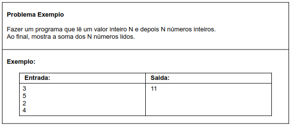

# Aula 056 - Estrutura Repetitiva `for`

Nesta aula, aprendemos a **estrutura repetitiva `for`**, utilizada quando **sabemos previamente a quantidade de repetições** ou quando trabalhamos com **intervalos de valores**.

Essa estrutura é muito comum em algoritmos que envolvem **contagens**, **iterações controladas** e **laços baseados em número fixo de execuções**.

---

## 1. Quando utilizar a estrutura `for`

Utilizamos a estrutura `for` quando:

- Sabemos **quantas vezes** o bloco de código deve ser executado  
- Trabalhamos com **contadores** (progressivos ou regressivos)  
- Temos um **intervalo bem definido** de valores  

**Diferença em relação ao `while`:**

- `while` → quando **não sabemos** quantas repetições ocorrerão  
- `for` → quando **sabemos previamente** a quantidade de repetições  

---

## 2. Sintaxe da estrutura `for`

A estrutura `for` possui **três partes**, separadas por ponto e vírgula:

```java
for (inicialização; condição; incremento) {
    // comandos a serem repetidos
}
```

### 2.1 Explicação das Partes:
| Parte         | Função                                  |
| ------------- | --------------------------------------- |
| Inicialização | Executada **apenas uma vez**, no início |
| Condição      | Testada antes de cada repetição         |
| Incremento    | Executado **após cada repetição**       |

A condição **funciona exatamente** como no `while`:
- true → executa o bloco
- false → sai da repetição

---

## 3. Uso do for como contador progressivo e regressivo

### 3.1 Uso do `for` como contador progressivo:

```java
for (int i = 0; i < 5; i++) {
    System.out.println(i);
}
```

**Saída:**
```bash
0
1
2
3
4
```

O contador começa em `0` e vai até `4`.  
Quando `i` chega em `5`, a **condição se torna falsa** e o laço é **encerrado**.

### 3.2 Contagem regressiva com `for`

```java
for (int i = 4; i >= 0; i--) {
    System.out.println(i);
}
```

**Saída:**
```bash
4
3
2
1
0
```

Nesse caso:
- Inicialização começa em `4`
- Condição: `i >= 0`
- Incremento: `i--` (decremento)

## 4. Problema exemplo



> [Ver algoritmo desse problema](../../../workspace/aula056_exemplo01_for/src/Main.java)

### Lógica aplicada:

1. Lê o valor `n`
2. Inicializa `soma = 0`
3. Repete `n` vezes:
    - Lê um número `x`
    - Soma `x` à variável soma
4. Exibe o valor final da soma

---
