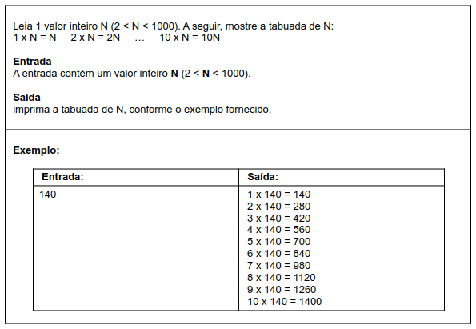
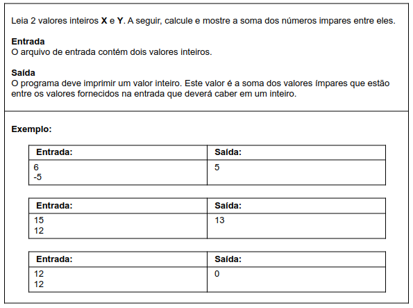
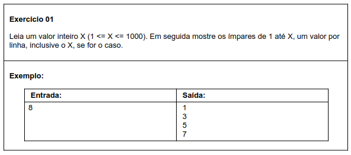
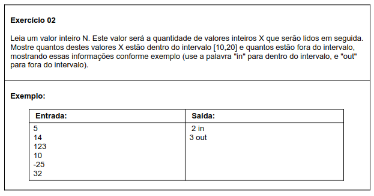
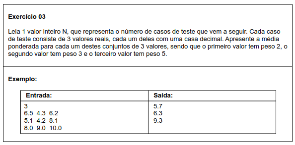
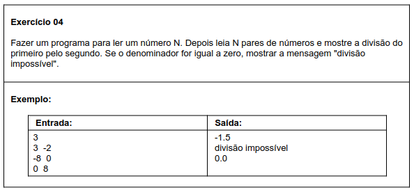
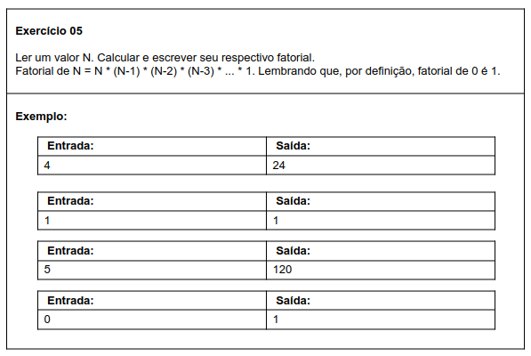
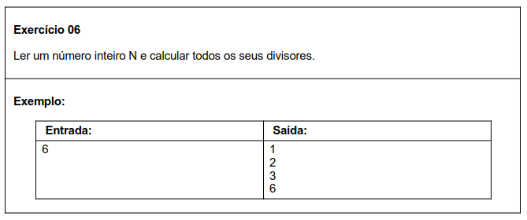
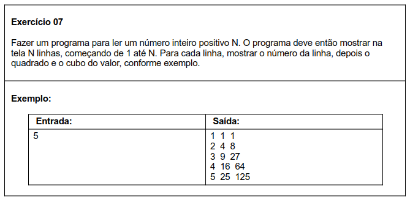

# Aula 059 e 060 – Exercícios sobre Estrutura Repetitiva `for`

Já estudamos a **estrutura repetitiva `for`**, utilizada principalmente quando o número de repetições é **conhecido previamente** e existe uma **variável de controle bem definida**.

A estrutura `for` é muito utilizada para:
- **Contagens**
- **Sequências**
- Repetições com comportamento **previsível**

Agora é o momento de **praticar** esses conceitos por meio de exercícios, consolidando o entendimento da regra de funcionamento do `for` e do controle das variáveis envolvidas no laço.

> Os exercícios desta seção foram retirados do [Beecrowd (URI Online Judge)](https://www.urionlinejudge.com.br).

### Revisão teórica (opcional)

Caso queira revisar o conteúdo teórico antes de resolver os exercícios, consulte as aulas:

- [Aula 056 – Estrutura Repetitiva `for`](../../../curso_java/secao06_estruturas_repetitivas/aula056_estrutura_repetitiva_for/aula056_estrutura_repetitiva_for.md)
- [Aula 057 – Teste de Mesa com Estrutura `for`](../../../curso_java/secao06_estruturas_repetitivas/aula057_teste_de_mesa_com_for/aula057_teste_de_mesa_com_for.md)

### Observação

Nos códigos apresentados a seguir, foram adicionadas **mensagens de interação com o usuário** (ex.: `"Digite um valor:"`), com o objetivo de tornar a execução mais didática em um ambiente de estudo.

⚠️ **Atenção**:  
Em plataformas de correção automática (como Beecrowd/URI ou outros juízes online), essas mensagens **não devem ser incluídas**, pois a saída do programa precisa coincidir exatamente com o formato esperado pelo enunciado.

---

## 60.1 Exercícios Resolvidos

Nesta seção estão os **exercícios resolvidos**, com foco no uso correto da estrutura `for`, controle de variáveis e lógica de repetição.

### 60.1.1 Tabuada

**Meu Algoritmo com a Resolução para esse Problema:**  
[Ver Algoritmo](../../../workspace/aula059e060_exercicio_resolvido01_tabuada/src/Main.java)

Confira a aula onde esse exercício é resolvido passo a passo, com foco no uso da estrutura `for`:  
[Ir para o Vídeo](https://www.youtube.com/watch?v=JTa8WEhV38E)

---

### 60.1.2 Soma dos Ímpares

**Meu Algoritmo com a Resolução para esse Problema:**  
[Ver Algoritmo](../../../workspace/aula059e060_exercicio_resolvido02_soma_impares/src/Main.java)

Confira a aula onde esse exercício é resolvido passo a passo, com foco no uso da estrutura `for`:  
[Ir para o Vídeo](https://www.youtube.com/watch?v=RVJnkOyc7Kk)

---

## 60.2 Exercícios Propostos

### 60.2.1 Listar Ímpares

**Meu Algoritmo com a Resolução para esse Problema:**  
[Ver Algoritmo](../../../workspace/aula059e060_exercicio_proposto01_listar_impares/src/Main.java)

---

### 60.2.2 Valores no Intervalo

**Meu Algoritmo com a Resolução para esse Problema:**  
[Ver Algoritmo](../../../workspace/aula059e060_exercicio_proposto02_valores_intervalo/src/Main.java)

---

### 60.2.3 Média Ponderada

**Meu Algoritmo com a Resolução para esse Problema:**  
[Ver Algoritmo](../../../workspace/aula059e060_exercicio_proposto03_media_ponderada/src/Main.java)

---

### 60.2.4 Divisão de Pares

**Meu Algoritmo com a Resolução para esse Problema:**  
[Ver Algoritmo](../../../workspace/aula059e060_exercicio_proposto04_divisao_de_pares/src/Main.java)

---

### 60.2.5 Fatorial

**Meu Algoritmo com a Resolução para esse Problema:**  
[Ver Algoritmo](../../../workspace/aula059e060_exercicio_proposto05_fatorial/src/Main.java)

---

### 60.2.6 Todos os Divisores

**Meu Algoritmo com a Resolução para esse Problema:**  
[Ver Algoritmo](../../../workspace/aula059e060_exercicio_proposto06_divisores/src/Main.java)

---

### 60.2.7 Quadrado e Cubo

**Meu Algoritmo com a Resolução para esse Problema:**  
[Ver Algoritmo](../../../workspace/aula059e060_exercicio_proposto07_quadrado_cubo/src/Main.java)

---
