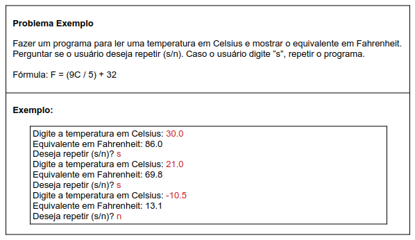

# Aula 061 – Estrutura Repetitiva `do-while`

Nesta aula estudamos a **estrutura repetitiva `do-while`**, também conhecida como **“faça-enquanto”**.

Essa estrutura é **menos utilizada** que `while` e `for`, porém é **fundamental** em situações específicas, pois possui uma característica importante:

> 🔹 **O bloco de comandos é executado pelo menos uma vez**, já que a condição é verificada **apenas no final do laço**.

---

## 61.1 Estrutura e Regra de Funcionamento

A sintaxe da estrutura `do-while` em Java é:

```java
do {
    comandos
} while (condicao);
```

### Regras importantes:

- O bloco dentro do do é executado **antes** de qualquer verificação
- A **condição é testada somente no final**
- Se a condição for **verdadeira**, o laço se repete
- Se a condição for **falsa**, o laço é encerrado
- O bloco será executado **ao menos uma vez**, independentemente da condição

### Comparação com `while`:

| Estrutura  | Teste da condição | Execução mínima |
| ---------- | ----------------- | --------------- |
| `while`    | No início         | 0 vezes         |
| `do-while` | No final          | 1 vez           |

---

## 61.2 Problema Exemplo



### Minha Solução Usando do-while

[ver algoritmo](../../../workspace/aula061_exemplo01_dowhile/src/Main.java)

---

## 61.3 Por que `do-while é a melhor escolha aqui?

Se utilizássemos `while`, seria necessário:

- Inicializar a variável de controle **antes**
- Fazer um “jeitinho” para garantir a primeira execução

Com `do-while`:

- Não há necessidade de inicialização artificial
- O código fica **mais limpo e sem gambiarras**
- A lógica reflete exatamente o problema proposto

---

## 61.4 Observações Importantes

- A condição do `do-while` **sempre termina com ponto e vírgula (;)**
- A variável usada na condição deve ser declarada fora do bloco
- O `do-while` é ideal quando:
    - O programa precisa executar pelo menos uma vez
    - A decisão de repetir depende de uma ação do usuário
    - A condição lógica só pode ser avaliada após o processamento

---

## 61.5 Conclusão

Nesta aula aprendemos que:

- A estrutura do-while executa o bloco antes de testar a condição
- Ela garante ao menos uma execução
- É especialmente útil em:
    - Menus
    - Programas interativos
    - Repetições controladas por resposta do usuário

---