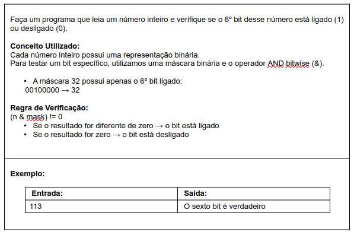

# Aula 064 – Operadores Bitwise

Nesta aula estudamos os **operadores bitwise**, que realizam **operações lógicas bit a bit** sobre números inteiros, considerando sua **representação binária interna**.

Esses operadores são comuns em:

- Programação de baixo nível
- Redes
- Sistemas embarcados
- Manipulação de flags e máscaras de bits

---

## 64.1 O que são Operadores Bitwis3?

Operadores bitwise trabalham **bit a bit**, considerando a representação binária interna dos números inteiros.

Não confundir com operadores lógicos (`&&`, `||`).

| Operador    | Símbolo | Descrição                             |
| ----------- | ------- | ------------------------------------- |
| AND bitwise | `&`     | Verdadeiro se ambos os bits forem 1   |
| OR bitwise  | `\|`     | Verdadeiro se pelo menos um bit for 1 |
| XOR bitwise | `^`     | Verdadeiro se **apenas um** bit for 1 |

---

## 64.2 Exemplo com Números Inteiros

Considere:
```text
n1 = 89 → em binário: 01011001
n2 = 60 → em binário: 00111100
```
| Operação  | Resultado Binário | Resultado Decimal |     |
| --------- | ----------------- | ----------------- | --- |
| `n1 & n2` | `00011000`        | 24                |     |
| `n1 \| n2`| `01111101`        | 125               |     |
| `n1 ^ n2` | `01100101`        | 101               |     |

---

## 64.3 Exemplo em Java

```java
public class Main {
    public static void main(String[] args) {

        int n1 = 89; // Em binário: 01011001
        int n2 = 60; // Em binário: 00111100

        System.out.println(n1 & n2); // 24
        System.out.println(n1 | n2); // 125
        System.out.println(n1 ^ n2); // 101
    }
}
```

> **Obs:** Ao utilizar operadores bitwise, o Java realiza as operações bit a bit internamente em binário, mas o valor final continua sendo do tipo `int`. Por isso, a saída é exibida em decimal.

---

## 64.4 Problema Exemplo – Testando um Bit com Operador Bitwise



#### Solução em Java
[Ver algoritmo](../../../workspace/aula064_exemplo01_operador_bitwise_testa_bit/src/Main.java)

Esse tipo de verificação é muito comum em:

- Programação de baixo nível
- Manipulação de bits e flags
- Interfaces de rede
- Sistemas embarcados e microcontroladores

---
