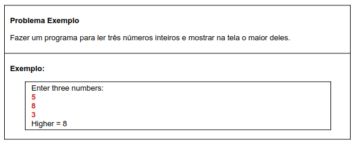

# Aula 067 – Funções (Sintaxe)

Nesta aula iniciamos o estudo sobre **funções em Java**, com foco na **sintaxe**, ou seja, como elas são escritas e utilizadas na linguagem.

O aprofundamento sobre funções (métodos) acontecerá ao longo do curso, especialmente em **Orientação a Objetos**.

---

## 67.1 O que são Funções?

Funções representam um **processamento com significado**, responsável por executar uma tarefa específica.

Elas encapsulam uma lógica que pode ser reutilizada sempre que necessário.

### Exemplo
```java
double raiz = Math.sqrt(25);
System.out.println(raiz); // 5.0
```
A função `Math.sqrt()` calcula a raiz quadrada. O Java já fornece essa função pronta.

- Recebe um valor como entrada: `25`
- Executa o cálculo internamente (envolve um algoritmo interno)
- Retorna o resultado: `5.0`

A função `System.out.println()` recebe um valor e apenas executa a ação de imprimir

---

## 67.2 Funções com e sem Retorno

Uma função pode:

- **Receber dados de entrada** (parâmetros)
- **Retornar um valor** ou apenas **executar uma ação**

### Com retorno
```java
double raiz = Math.sqrt(25);
```

### Sem retorno
```java
System.out.println("Olá"); // apenas imprime na tela
```

---

## 67.3 Vantagens do Uso de Funções

- **Modularização**: divide o programa em partes menores
- **Delegação**: a lógica fica encapsulada (isolada) em outro local
    - Exemplo: Ao usar `Math.sqrt()`, não precisamos implementar o algoritmo da raiz quadrada — a função faz isso internamente e retorna o resultado pronto.
- **Reaproveitamento**: a mesma função pode ser usada várias vezes em diferentes partes do programa.

---

## 67.4 Funções em Java

Em Java, funções definidas dentro de classes são chamadas de **métodos** e sempre pertencem a uma classe.

Esse conceito será aprofundado mais adiante, na parte de **Orientação a Objetos**.

---

## 67.5 Problema Exemplo



### 67.5.1 Solução Inicial (Sem Funções)

A lógica para encontrar o maior entre três números pode ser feita com estruturas condicionais:

- Se `num1 > num2` e `num1 > num3`, então `num1` é o maior
- Caso contrário, compara `num2` com `num3`

Essa solução funciona, mas deixa o programa **menos organizado**.

[Ver algoritmo sem funções](../../../workspace/aula067_exemplo01_sem_funcoes/src/course/Program.java)

### 67.5.2 Delegando a Lógica para Funções

Para deixar o programa mais organizado, a lógica é dividida em funções:

- Uma função para **calcular o maior valor**
- Outra função para **mostrar o resultado na tela**

[Ver algoritmo com funções](../../../workspace/aula067_exemplo01_com_funcoes/src/course/Program.java)

#### 67.5.2.1 Função `max()`

Responsável por receber três valores inteiros e **retornar o maior deles**.

- Recebe três parâmetros
- Retorna um valor do tipo `int` (o maior entre os três parâmetros recebidos)
- As variáveis existem **apenas dentro do escopo da função**

#### 67.5.2.2 Função `showResult()`

Responsável apenas por **mostrar o resultado na tela**.

- Executa uma ação
- Não retorna valor (`void`)

#### 67.5.2.3 Programa Principal (`main`)

O método `main` coordena o fluxo do programa:

- Lê os valores
- Chama a função `max`
- Chama a função `showResult`

---

## 67.6 Observações Importantes

- Funções possuem **escopo próprio**
- Variáveis criadas dentro da função **não existem fora dela**
- O comando `return` encerra a execução da função
- Em Java, o programa sempre começa pelo método `main`

