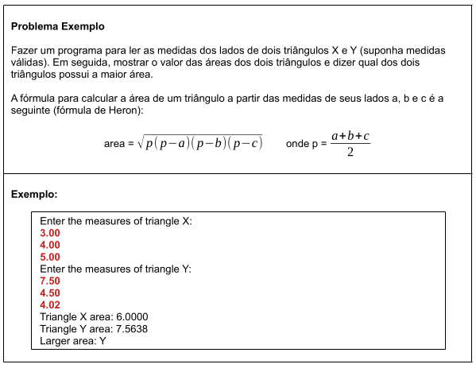

# Aula 071 – Resolvendo um Problema sem Orientação a Objetos

Nesta aula, resolvemos um problema sem **utilizar Programação Orientada a Objetos**, com o objetivo de evidenciar **as limitações dessa abordagem** e preparar o terreno para a introdução da **POO nas próximas aulas**.

---

## 71.1 Problema Exemplo

Nesta aula, o problema foi resolvido **sem a utilização de Programação Orientada a Objetos**.  
A seguir, encontra-se o algoritmo utilizado:

[ver algoritmo](../../../workspace/aula071_problema01_sem_poo/src/application/Program.java)

### 71.1.1 Abordagem Utilizada

A solução foi construída de forma **procedural**, utilizando apenas recursos básicos da linguagem:

- Variáveis primitivas
- Estruturas de controle (`if/else`)
- Funções prontas da linguagem (`Math.sqrt`)
- Código totalmente concentrado no método `main`

Cada lado dos triângulos foi representado por **variáveis simples**, como:

- `xA`, `xB`, `xC`
- `yA`, `yB`, `yC`

### 71.1.2 Etapas da Solução

1. Leitura das medidas do triângulo **X**
2. Leitura das medidas do triângulo **Y**
3. Cálculo do semiperímetro (`p`)
4. Cálculo das áreas dos dois triângulos (fórmula de Heron)
5. Impressão das áreas com formatação
6. Comparação para determinar qual triângulo possui a maior área

### 71.1.3 Observações Importantes

- Todo o código está concentrado no método `main`
- Não há reaproveitamento de lógica
- A mesma fórmula é repetida para cada triângulo
- O código funciona corretamente, porém **não é escalável**
- A organização e manutenção se tornam mais difíceis à medida que o problema cresce

### 71.1.4 Conclusão

A solução atende ao problema proposto, porém evidencia algumas limitações:

- Código pouco organizado
- Repetição de lógica
- Ausência de uma representação clara do conceito de **triângulo** como entidade

Nas próximas aulas, esse mesmo problema será **refatorado gradualmente** utilizando **Programação Orientada a Objetos**, com a introdução de **classes, atributos e métodos**, tornando o código mais organizado, reutilizável e expressivo.

---