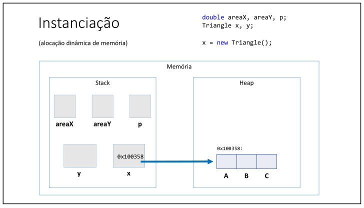

# Aula 072 – Introdução à Programação Orientada a Objetos (Classe Triângulo)

Nesta aula, iniciamos a **refatoração da solução anterior** aplicando os **conceitos básicos de Programação Orientada a Objetos (POO)**.
O objetivo é **melhorar a representação do problema**, modelando o conceito de **triângulo como uma entidade**, em vez de utilizar variáveis isoladas.

---

## 72.1 Motivação: Limitações da Abordagem Procedural

Na aula anterior, cada triângulo foi representado por **três variáveis independentes**, por exemplo:

- Triângulo **X**: `xA`, `xB`, `xC`
- Triângulo **Y**: `yA`, `yB`, `yC`

Essa abordagem apresenta problemas importantes:

- Um **conceito único** (triângulo) é representado por várias variáveis soltas
- O código fica mais difícil de entender, manter e escalar
- Não há uma representação explícita da entidade **Triângulo**

A solução para isso é utilizar **classes**, que permitem modelar entidades do mundo real de forma mais organizada.

---

## 72.2 Conceito de Classe

Uma **classe** é um **tipo estruturado** que pode conter **membros**, sendo eles:

- **Atributos** → representam os dados
- **Métodos** → representam comportamentos ou operações

### Exemplo conceitual

- Classe `Triangle`
    - Atributos: `a`, `b`, `c`

- Classe `Client`
    - Atributos: `name`, `cpf`, `phone`, `email`

Nesta aula, a classe criada possui **apenas atributos**, sem métodos.

> Recursos como **construtores, encapsulamento, herança e polimorfismo** serão abordados nos próximos capítulos.

---

## 72.3 Criando a Classe Triangle

Para representar corretamente um triângulo, foi criada uma classe chamada `Triangle`, localizada no pacote `entities`, pois ela representa uma **entidade do domínio do problema**.

### Estrutura da Classe
```java
package entities;

public class Triangle {
    public double a;
    public double b;
    public double c;
}
```

### Observações importantes

- Cada atributo representa um **lado do triângulo**
- O modificador `public` permite acesso direto aos atributos (por enquanto)
- A classe define **o tipo**, mas **não cria objetos**

---

## 72.4 Declarando Variáveis do Tipo `Triangle`

No programa principal da aula 071, as variáveis eram isoladas, nessa aula 072 foram substituídas por **variáveis do tipo** `Triangle`:

```java
Triangle x, y;
```

Neste momento:

- `x` e `y` **ainda não são objetos**
- São apenas **variáveis de referência**

## 72.5 Instanciação de Objetos (`new`)

Para que os objetos existam de fato na memória, é necessário **instanciá-los**:

```java
x = new Triangle();
y = new Triangle();
```

### Conceito-chave

- A palavra-chave `new` **aloca memória dinamicamente**
- Um **objeto do tipo Triangle** é criado na memória
- A variável passa a **referenciar esse objeto**

> ver mais detalhes em 72.8

---

## 72.6 Acesso aos Atributos do Objeto

Após a instanciação, os atributos são acessados usando o **operador ponto (`.`)**:

```java
x.a = scanner.nextDouble();
x.b = scanner.nextDouble();
x.c = scanner.nextDouble();

y.a = scanner.nextDouble();
y.b = scanner.nextDouble();
y.c = scanner.nextDouble();
```

O mesmo princípio é utilizado no cálculo da área:

```java
double pX = (x.a + x.b + x.c) / 2.0;
double areaX = Math.sqrt(pX * (pX - x.a) * (pX - x.b) * (pX - x.c));
```

---

## 72.7 Comparação com a Solução Anterior

### [Antes (Aula 071)](../../../curso_java/secao08_introducao_programacao_orientada_objetos/aula071_problema01_sem_orientacao_objetos/aula071_problema01_sem_orientacao_objetos.md)

- Várias variáveis para representar um único triângulo
- Código menos organizado
- Baixa expressividade

### Agora (Aula 072)

- Um triângulo é representado por **uma única variável**
- Os dados estão **agrupados logicamente**
- Código mais limpo e semântico
- Melhor base para reutilização e evolução

Implementação da aula 072 utilizando a **Classe `Triangle`**:

- [Programa principal](../../../workspace/aula072_problema01_classe_com_atributos/src/application/Program.java)
- [Classe `Triangle`](../../../workspace/aula072_problema01_classe_com_atributos/src/entities/Triangle.java)

---

## 72.8 Modelo de Memória: Stack e Heap

### Declaração da variável
```java
Triangle x;
```

- A variável `x` é criada na **Stack**
- Ela ainda **não contém dados do triângulo**

### Instanciação
```java
x = new Triangle();
```

- Um objeto `new Triangle()` é criado na **Heap**
- A variável `x` passa a armazenar um **endereço de memória** desse objeto
- Esse endereço aponta para o objeto na Heap



> Variáveis de classe **não armazenam o objeto**, mas sim uma **referência para ele**, ou seja o endereço que aponta para ele.

## 72.9 Classe × Objeto

- **Classe** → definição do tipo (`Triangle`)

    - “Um triângulo possui três lados: `a`, `b` e `c`” (Atributos da classe)

- **Objeto** → instância concreta da classe

    - `x` e `y` são triângulos específicos, com valores próprios

Instanciar um objeto significa **criar uma instância da classe na memória**.

---

## 72.10 Conclusão

Nesta aula, demos o primeiro passo sólido em Programação Orientada a Objetos:

- Criamos uma **classe personalizada**
- Modelamos corretamente uma **entidade do problema**
- Utilizamos **instanciação e acesso a atributos**
- Melhoramos significativamente a organização do código

Nas próximas aulas, essa estrutura será **evoluída**, com a introdução de **métodos**, tornando o código ainda mais expressivo, reutilizável e alinhado às boas práticas de POO.

---