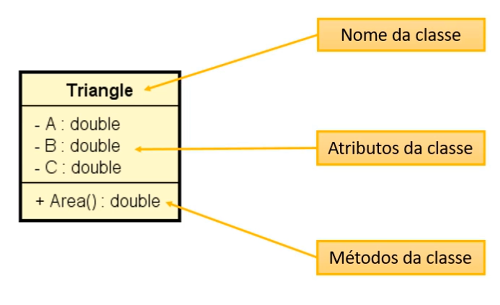

# Aula 073 – Criando um Método na Classe Triangle

Nesta aula, evoluímos a solução anterior adicionando um **método à classe** `Triangle`, com o objetivo de obter dois benefícios centrais da Programação Orientada a Objetos: **reaproveitamento de código** e **delegação de responsabilidades**.

---

## 73.1 Problema na Implementação da Aula 072

Apesar da melhoria obtida na Aula 072 com a criação da classe `Triangle`, o cálculo da área ainda apresentava dois problemas:

- **Repetição de código**:
A mesma lógica da fórmula de Heron era utilizada tanto para o triângulo `x` quanto para o `y`.

- **Responsabilidade mal distribuída**:
O cálculo da área estava no programa principal, quando deveria ser responsabilidade do próprio triângulo.

---

## 73.2 Delegando o Cálculo para a Classe `Triangle`

O cálculo da área de um triângulo **pertence conceitualmente à entidade Triângulo**  
Portanto, essa lógica deve ser encapsulada dentro da própria classe.

Para isso, foi criado um **método** responsável por calcular e retornar a área do triângulo.

---

## 73.3 Criando o Método `area()`

Na classe `Triangle`, foi adicionado o seguinte método:

```java
package entities;

public class Triangle {

    public double a;
    public double b;
    public double c;

    // Método adicionado:
    public double area() {
        double p = (a + b + c) / 2.0;
        return Math.sqrt(p * (p - a) * (p - b) * (p - c));
    }
}
```

### Observações importantes

- O método é `public`, permitindo acesso a partir de outras classes
- O tipo de retorno é `double`, pois representa uma área
- O método **não recebe parâmetros**, pois utiliza os próprios atributos da classe (`a`, `b`, `c`)

---

## 73.4 Utilizando o Método no Programa Principal

Com o método criado, o programa principal ficou significativamente mais simples.

### Antes:

Lógica para calcular a área dos triângulos: de x e y

```java
p = (x.a + x.b + x.c) / 2.0;
areaX = Math.sqrt(p * (p - x.a) * (p - x.b) * (p - x.c));
		
p = (y.a + y.b + y.c) / 2.0;
areaY = Math.sqrt(p * (p - y.a) * (p - y.b) * (p - y.c));
```

### Agora:

No programa principal, chama-se apenas o metodo `area()`  
toda lógica para calcular a área está implementada na própria classe `Triangle`

```java
double areaX = x.area();
double areaY = y.area();
```

> Toda a lógica de cálculo foi removida do main, restando apenas a chamada ao método.

---

## 73.5 Estrutura do Método (Revisão)

A estrutura de um método em Java segue o padrão:

- Modificador de acesso
    - No nosso exemplo foi `public`
- Tipo de retorno
    - No nosso exemplo foi `double`
- Nome do método
    - No nosso exemplo foi `area()`
- Lista de parâmetros
    - No nosso exemplo é vazio (sem parâmetros) 
- Corpo do método (implementação da lógica)

Se o método **não retornasse valor** algum, o tipo de retorno seria `void`.

---

## 73.6 Diagrama de Classe (UML)

A classe `Triangle` pode ser representada por um **Diagrama de Classes UML**, composto por três partes:

1. Nome da classe
2. Atributos
3. Métodos



Esse tipo de diagrama será utilizado com frequência ao longo do curso para representar a estrutura das classes e suas responsabilidades.

---

## 73.7 Benefícios Obtidos

A criação do método trouxe dois benefícios fundamentais:

**Reaproveitamento de Código**

- A lógica do cálculo da área foi escrita uma única vez
- Eliminação de código duplicado

**Delegação de Responsabilidades**

- Cada classe passa a ser responsável pelo que lhe diz respeito
- O triângulo sabe calcular sua própria área

Esse princípio está diretamente relacionado ao conceito de **coesão**, que será explorado mais adiante no curso.

## 73.8 Conclusão

**Na [aula 071](../../../curso_java/secao08_introducao_programacao_orientada_objetos/aula071_problema01_sem_orientacao_objetos/aula071_problema01_sem_orientacao_objetos.md) o problema exemplo foi resolvido sem POO.**

Ver algoritmo da aula 071:
- [Algoritmo da aula 071](../../../workspace/aula071_problema01_sem_poo/src/application/Program.java)

**Já na [aula 072](../../../curso_java/secao08_introducao_programacao_orientada_objetos/aula072_problema01_classe_triangle/aula072_problema01_classe_triangulo.md) criamos uma classe para representar o Triângulo, evoluindo a aula 071**

Ver algoritmo da aula 072:
- [Principal](../../../workspace/aula072_problema01_classe_com_atributos/src/application/Program.java)

- [Classe Triangle](../../../workspace/aula072_problema01_classe_com_atributos/src/entities/Triangle.java)

**Agora, Nesta aula (073)**:

- Criamos o **primeiro método** de uma classe personalizada
- Centralizamos a lógica onde ela realmente pertence
- Tornamos o código mais limpo, reutilizável e expressivo
- Demos um passo importante na consolidação da POO

Ver algoritmo dessa aula:
- [Principal](../../../workspace/aula073_problema01_metodos_para_classe/src/application/Program.java)
- [Classe Triangle](../../../workspace/aula073_problema01_metodos_para_classe/src/entities/Triangle.java)

> ainda poderia melhorar mais o código, mas vamos partir para outro exemplo nas próximas aulas e abordaremos mais conceitos sobre a POO

---