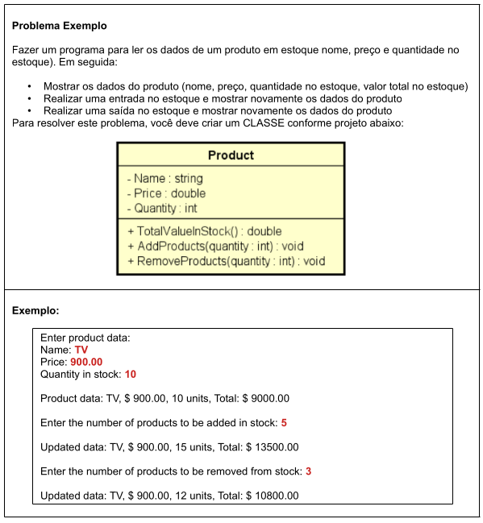

# Aula 074 a 076 – Controle de Estoque de Produto

Nestas aulas, é desenvolvido um **segundo problema exemplo** com o objetivo de consolidar os conceitos iniciais de **Programação Orientada a Objetos (POO)** em Java, servindo como preparação para os exercícios do capítulo.

O problema envolve a modelagem de um **produto em estoque**, sua representação como classe e a correta distribuição de responsabilidades entre a classe de domínio e o programa principal.

---

## Problema Exemplo – Controle de Estoque de Produto



---

## Aula 074 – Modelando a Classe `Product`

Nesta aula, iniciamos a resolução do problema criando a classe que representa a entidade central do domínio: o **Produto**.

### 74.1 Atributos da Classe

A classe `Product` possui três atributos públicos:

* `name` : nome do produto
* `price` : preço unitário
* `quantity` : quantidade em estoque

```java
package entities;

public class Product {

    public String name;
    public double price;
    public int quantity;
}
```

Esses atributos representam o **estado** do objeto Produto.

---

### 74.2 Métodos de Negócio

Além dos atributos, a classe possui métodos que representam **operações relacionadas ao produto**.

#### Valor total em estoque

Calcula o valor total do estoque multiplicando preço pela quantidade:

```java
public double totalValueInStock() {
    return price * quantity;
}
```

#### Entrada no estoque

Incrementa a quantidade em estoque com base no valor inteiro recebido como parâmetro:

```java
public void addProducts(int quantity) {
    this.quantity += quantity;
}
```

O uso de `this` permite diferenciar o atributo da classe do parâmetro do método.

#### Saída no estoque

Remove do estoque a quantidade especificada pelo valor inteiro recebido como parâmetro:

```java
public void removeProducts(int quantity) {
    this.quantity -= quantity;
}
```

Esses métodos representam o **comportamento** do objeto Produto.

---

### 74.3 Leitura dos Dados no Programa Principal

No programa principal, o usuário informa os dados iniciais do produto, que são armazenados diretamente no objeto:

```java
Product product = new Product();

System.out.println("Enter product data:");
System.out.print("Name: ");
product.name = sc.nextLine();

System.out.print("Price: ");
product.price = sc.nextDouble();

System.out.print("Quantity in stock: ");
product.quantity = sc.nextInt();
```

Neste ponto, a aplicação já é capaz de instanciar e manipular objetos do tipo `Product`.

---

## Aula 075 – Classe `Object` e Método `toString()`

Nesta aula, é introduzido o conceito de que **toda classe em Java herda implicitamente da classe `Object`**.

### 75.1 O problema da impressão direta do objeto

Ao tentar imprimir diretamente um objeto:

```java
System.out.println(product);
```

O resultado padrão é algo como:

```text
entities.Product@3feba861
```

Isso ocorre porque o método `toString()` herdado de `Object` não foi sobrescrito.

---

### 75.2 Sobrescrevendo o método `toString()`

Para definir como o objeto deve ser representado em forma de texto, sobrescrevemos o método `toString()` na classe `Product`:

```java
@Override
public String toString() {
	return "Product data: "
			+ name
			+ ", $ "
			+ String.format("%.2f", price)
			+ ", "
			+ quantity
			+" units, Total: $ "
			+ String.format("%.2f", totalValueInStock());
}
```

A partir disso, sempre que o objeto estiver em um contexto de impressão, o Java chamará implicitamente esse método.

---

### 75.3 Benefícios do `toString()`

* Centraliza a formatação do objeto
* Evita código repetido no programa principal
* Torna a impressão mais legível e semântica

---

## Aula 076 – Finalizando o Problema

Nesta aula, o programa é finalizado com as operações de **entrada e saída de produtos**, utilizando os métodos da classe `Product`.

Em seguida, o programa é implementado conforme os requisitos definidos no problema: exibindo os dados iniciais, efetuando a **entrada no estoque**, **saída no estoque**, etc.

Com isso, o problema é completamente resolvido.

### Segue o algoritmo completo desenvolvido:
- [Classe Product](../../../workspace/aula074ate076_controle_estoque_produto/src/entities/Product.java)

- [Principal](../../../workspace/aula074ate076_controle_estoque_produto/src/application/Program.java)

---

