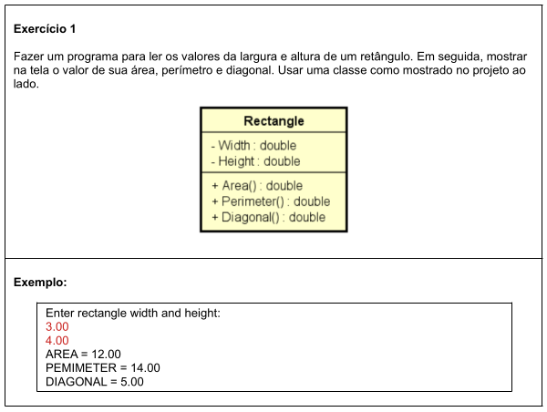
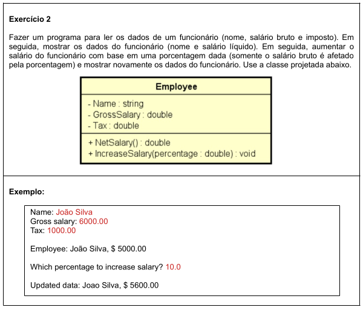
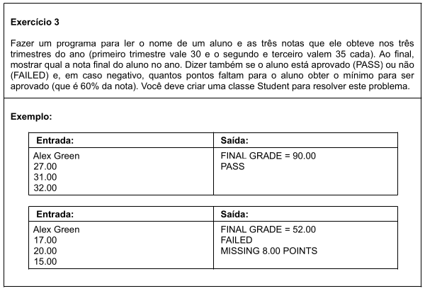

# Aula 077 - Exercícios de Introdução a POO

Nesta aula, resolvemos exercícios práticos com o objetivo de consolidar os conceitos iniciais de **Programação Orientada a Objetos (POO)**, incluindo **classes, atributos, métodos e encapsulamento básico**.

## Exercício 01 - Medidas do Retângulo

### Minha Implementação para esse problema:
- [Classe que representa retãngulo](../../../workspace/aula077_exercicio01_medidas_retangulo/src/entities/Rectangle.java)

- [Classe Principal](../../../workspace/aula077_exercicio01_medidas_retangulo/src/application/Program.java)

---

## Exercício 02 - Salário do Funcionário

### Minha Implementação para esse problema:
- [Classe que representa funcionário](../../../workspace/aula077_exercicio02_salario_funcionario/src/entities/Employee.java)

- [Classe Principal](../../../workspace/aula077_exercicio02_salario_funcionario/src/application/Program.java)

---

## Exercício 03 - Notas do Aluno

### Minha Implementação para esse problema:
- [Classe que representa estudante](../../../workspace/aula077_exercicio03_notas_aluno/src/entities/Student.java)

- [Classe Principal](../../../workspace/aula077_exercicio03_notas_aluno/src/application/Program.java)

---
