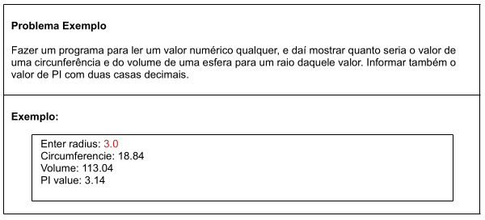
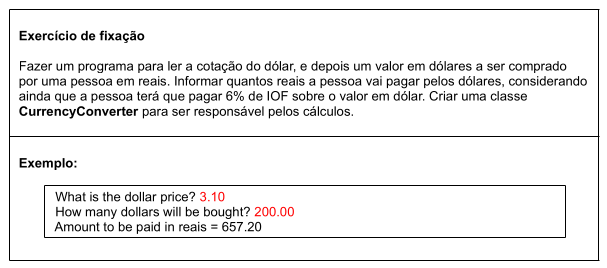

# Aula 078 e 079 – Membros Estáticos em Java

Nesta sequência de aulas, é apresentado o conceito de **membros estáticos**, também chamados de **membros da classe**, por meio de um problema exemplo envolvendo cálculos geométricos.

O objetivo é compreender **quando faz sentido usar membros de instância** e **quando utilizar membros estáticos**, analisando diferentes versões de uma mesma solução.

---

## 78-79.1 Conceito: Membros de Instância vs Membros Estáticos

Até aqui, vimos que uma classe pode possuir:

* **Atributos** (estado)
* **Métodos** (comportamento)

Quando esses membros dependem de um objeto específico, ou seja, **cada instância pode produzir um resultado diferente**, eles são chamados de **membros de instância**. Já os **membros estáticos**:

* Não dependem de objetos
* São associados diretamente à classe
* São acessados pelo nome da classe

Exemplo clássico:

```java
Math.sqrt(9);
```

Aqui, `sqrt` é um método estático da classe `Math`.  
Perceba que não é preciso instânciar com algo do tipo: `new Math()`

---

## 78-79.2 Problema Exemplo – Circunferência e Volume da Esfera



---

### 78-79.2.1 Versão 1 – Métodos Estáticos na Classe Principal

Nessa primeira versão, toda a lógica é implementada na própria classe `Program`.

#### Características:

* Constante `PI` declarada como `static final`
    - `static` informa que é um membro da **classe** e não da Instância (objeto)
    - `final` indica que o valor é constante, ou seja, não pode ser alterado após a atribuição
* Métodos `circumference()` e `volume()` declarados como `static`
* Necessário porque o método `main` é estático e **só pode acessar diretamente membros que também sejam estáticos**

```java
public static final double PI = 3.14159;

public static void main(String[] args) {
    // implementação...
    // aqui é feita as chamadas dos membros estaticos:
    double circumferencie = circumferencie(radius);
	double volume = volume(radius);
}

public static double circumference(double radius) {
    return 2.0 * PI * radius;
}

public static double volume(double radius) {
    return 4.0 * PI * radius * radius * radius / 3.0;
}
```

#### Observação importante

- Um método **estático não pode chamar diretamente um método não estático** da mesma classe. Como o `main` é `static`, por isso, todos os membros utilizados pelo `main` precisam ser estáticos.

- Perceba que como os membros estaticos e o `main` estão na mesma classe, as chamadas desses metódos estaticos não foi preciso usar o nome da classe antes, foram chamados diretamente pelo nome do método, **sem a necessidade do nome da classe**.
    - ex: `circumferencie(radius);`


#### Algoritmo completo dessa Versão 1:

[ver algortimo](../../../workspace/aula078e079_exemplo01_membros_estaticos_classe_principal/src/application/Program.java)

---

### 78-79.2.2 Versão 2 – Classe Utilitária com Membros de Instância

Na segunda versão, é criada uma classe `Calculator` para delegar os cálculos geométricos.

#### Classe `Calculator` (sem `static`)

```java
public class Calculator {

    public final double PI = 3.14159;

    public double circumference(double radius) {
        return 2.0 * PI * radius;
    }

    public double volume(double radius) {
        return 4.0 * PI * radius * radius * radius / 3.0;
    }
}
```

#### Uso no programa principal

```java
Calculator calc = new Calculator();

double circumferencie = calc.circumference(radius);
double volume = calc.volume(radius);
```

#### Análise crítica

Essa solução **funciona**, mas conceitualmente não é ideal:

* Cada objeto `Calculator` possui seu próprio valor de `PI` sendo que `PI` é uma constante e **não varia, portanto não faz sentido existir uma cópia desse valor para cada objeto**
* Os resultados dos cálculos não variam entre objetos, ou seja é a mesma lógica de calculo, independentemente de qualquer objeto
* * A criação de objetos é desnecessária, pois nenhum estado do objeto é utilizado nos cálculos

#### Algoritmo completo dessa Versão 2:

- [Classe Calculator](../../../workspace/aula078e079_exemplo02_classe_utilitaria_membros_instancia/src/util/Calculator.java)

- [Calsse Principal](../../../workspace/aula078e079_exemplo02_classe_utilitaria_membros_instancia/src/application/Program.java)

---

### 78-79.2.3 Versão 3 – Classe Utilitária com Membros Estáticos

Como os cálculos **não dependem de estado**, a solução correta é tornar os membros da classe `Calculator` **estáticos**.

#### Classe `Calculator` com membros estáticos

```java
public class Calculator {

    public static final double PI = 3.14159;

    public static double circumference(double radius) {
        return 2.0 * PI * radius;
    }

    public static double volume(double radius) {
        return 4.0 * PI * radius * radius * radius / 3.0;
    }
}
```

#### Uso no programa principal

```java
double circumferencie = Calculator.circumference(radius);
double volume = Calculator.volume(radius);

System.out.printf("PI value: %.2f%n", Calculator.PI);
```

Agora:

* Não é necessário instanciar objetos
* Os métodos são chamados diretamente pela classe
* A solução está alinhada com o conceito de **classe utilitária**

#### Boas Práticas

Em Java, é possível chamar métodos ou atributos estáticos utilizando uma referência de objeto, por exemplo:

```java
Calculator calc = new Calculator();
double c = calc.circumference(radius);
```

Esse código **funciona**, porém **não é recomendado**.

Isso acontece porque métodos estáticos pertencem à **classe**, e não ao objeto. Mesmo utilizando a referência `calc`, o Java resolve a chamada em tempo de compilação como:

```java
Calculator.circumference(radius);
```

Por esse motivo, IDEs como o Eclipse exibem um warning, indicando que o membro estático deve ser acessado diretamente pela classe.
 
Sempre acessar membros estáticos pelo nome da **classe**, deixando explícito que eles não dependem de instâncias.

#### Algoritmo completo dessa Versão 3:

- [Classe Calculator](../../../workspace/aula078e079_exemplo03_classe_utilitaria_membros_estaticos/src/util/Calculator.java)

- [Classe Principal](../../../workspace/aula078e079_exemplo03_classe_utilitaria_membros_estaticos/src/application/Program.java)

---

## 78-79.3 Comparação com Membros de Instância (Exemplo do Triângulo)

No problema do triângulo:

* Cada objeto possui sua própria área
* O método `area()` depende dos atributos do objeto

```java
x.area(); // valor específico do triângulo X
y.area(); // valor específico do triângulo Y
```

Nesse caso, **membros de instância fazem sentido**.

Já na calculadora:

* `PI`, `circumference()` e `volume()` sempre retornam o mesmo resultado para os mesmos dados
* Não dependem de objeto

Logo, **membros estáticos são a escolha correta**.

---

## 78-79.4 Conclusão

* Use **membros de instância** quando o comportamento depende do estado do objeto
* Use **membros estáticos** quando o comportamento é independente de qualquer objeto
* Classes utilitárias são bons candidatos a conter apenas membros estáticos

Essa abordagem produz código mais claro, eficiente e conceitualmente correto dentro da Programação Orientada a Objetos.

---

## 80 Exercicio Fixação - Cotação do Dolár



### Algoritmo com a resolução do exercício:

- [Classe CurrencyConverter](../../../workspace/aula080_exercicio01_cotacao_dolar/src/util/CurrencyConverter.java)

- [Classe Principal](../../../workspace/aula080_exercicio01_cotacao_dolar/src/application/Program.java)