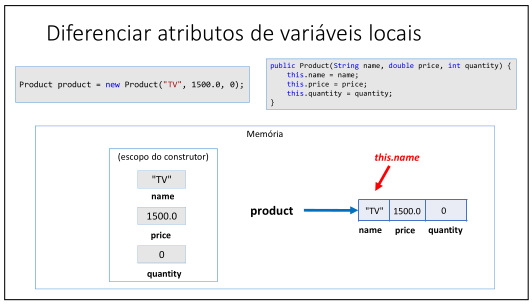

# Aula 084 – Palavra-chave this em Java

Nesta aula, aprofundamos o estudo da **palavra-chave** `this`, complementando o conteúdo visto na aula anterior sobre **construtores**.

O objetivo é entender **com clareza o que é** `this`, **como ele funciona na memória** e **quando deve ser utilizado**, evitando confusões comuns no início da Programação Orientada a Objetos.

---

## 84.1 O que é a palavra `this`?

Em Java, a palavra-chave `this` **é uma referência para o próprio objeto atual**.

Ou seja, dentro de uma classe, `this` representa a **instância do objeto que está sendo manipulada naquele momento**.

---

## 84.2 Usos mais comuns da palavra `this`

Os dois usos mais comuns da palavra `this` são:

1. **Diferenciar atributos da classe de variáveis locais**

2. **Passar o próprio objeto como argumento para um método ou construtor**  
(este segundo uso será explorado mais à frente no curso)

---

## 84.3 Diferenciando atributos de variáveis locais

Considere o exemplo abaixo, baseado no problema do **Produto em estoque**.

### Instanciação do objeto
```java
Product product = new Product("TV", 1500.0, 0);
```

Quando essa linha é executada:

- Um **objeto** `Product` **é criado na memória**
- O **construtor é chamado**
- Os valores `"TV"`, `1500.0` e `0` são copiados para os **parâmetros do construtor**

### Construtor da classe Product
```java
public Product(String name, double price, int quantity) {
    this.name = name;
    this.price = price;
    this.quantity = quantity;
}
```

Dentro do construtor, temos dois tipos de variáveis:

- **Atributos do objeto**
    → `this.name`, `this.price`, `this.quantity`

- **Variáveis locais (parâmetros do construtor)**
    → `name`, `price`, `quantity`

---

## 84.4 Por que o `this` é necessário?

Quando usamos apenas o nome da variável:

```java
name = name;
```

O Java **dá prioridade à variável local**, ou seja, o parâmetro do construtor.

Isso **não altera o atributo do objeto**, pois apenas reatribui o valor à variável local, gerando um erro lógico.

Já quando usamos:
```java
this.name = name;
```

Temos claramente:

- `this.name` → atributo do objeto
- `name` → variável local (parâmetro)

Assim, o valor do parâmetro é corretamente atribuído ao **campo do objeto**.

---

## 84.5 Modelo mental: o que acontece na memória?



Durante a execução do construtor:

- Os parâmetros (`name`, `price`, `quantity`) existem **apenas dentro do construtor**
- Os atributos (`this.name`, `this.price`, `this.quantity`) pertencem ao **objeto criado**
- O uso do `this` garante que estamos acessando os **campos do objeto**, e não as variáveis locais

Esse modelo mental é essencial para entender **como os dados são copiados para o objeto**.

---

## 84.6 Segundo uso do `this`: passar o próprio objeto como argumento

Outro uso importante da palavra `this` é **passar o próprio objeto atual como argumento** na chamada de um método ou construtor.

Esse uso aparece, por exemplo, no **projeto de xadrez**, quando uma peça precisa manter uma referência para a partida à qual pertence.

Exemplo retirado do curso:

```java
public class ChessMatch {
    (...)
    placeNewPiece('e', 1, new King(board, Color.WHITE, this));
    (...)
}
```

Nesse trecho:

- `this` refere-se ao **objeto atual da classe** `ChessMatch`
- Esse objeto é passado para o **construtor da classe** `King`
- Assim, a peça `King` passa a ter uma **referência para a partida de xadrez** (`ChessMatch`)

**Observação importante**  
Esse uso do `this` permite que objetos se relacionem entre si de forma controlada e coerente.

Apesar de ainda não explorarmos esse conceito em profundidade neste momento do curso, ele será essencial mais adiante, especialmente em projetos mais complexos.

---

## 84.7 Conclusão

- `this` é uma referência para o **objeto atual**
- É fundamental para diferenciar **atributos da classe** de **variáveis locais**
- Evita erros lógicos na inicialização de objetos
- Torna o código mais claro e expressivo
- Também pode ser usado para passar o próprio objeto como argumento (veremos mais adiante)

O entendimento correto da palavra `this` é essencial para escrever **classes bem projetadas** em Java.