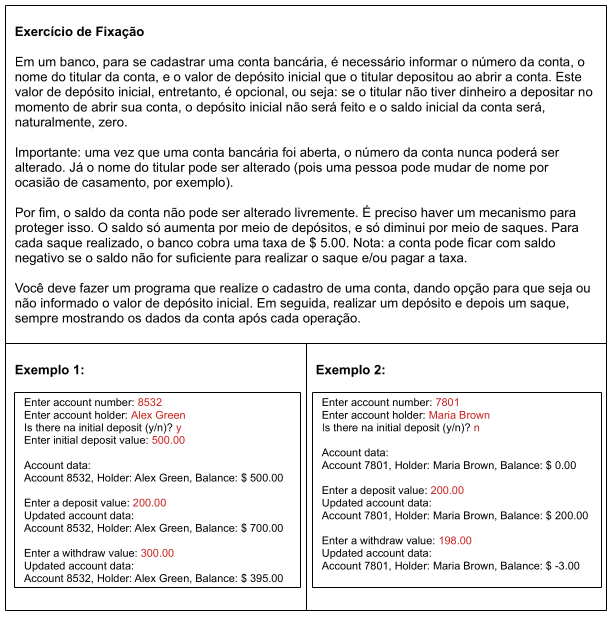

# Aula 89 - Exercício de Fixação: Conta Bancária

Nessa aula vamos utilizar tudo o que ja vimos até o momento para resolver o seguinte problema:



**Código completo**:
- [Classe ContaBancaria](../../../workspace/aula089_exercicio_fixacao_conta_bancaria/src/entities/ContaBancaria.java)
- [Classe Principal](../../../workspace/aula089_exercicio_fixacao_conta_bancaria/src/application/Program.java)

## 89.1 Pontos Técnicos Importantes do Código

### Uso de `deposit()` no construtor

Dentro do construtor, em vez de atribuir o valor de `initialDeposit` ao atributo `balance`:

```java
this.balance = initialDeposit;
```

Usamos o próprio método de depositar:

```java
deposit(initialDeposit);
```

Isso mantém a regra de negócio centralizada.  
Se amanhã o depósito tiver validação, o construtor já respeita.

---

### Uso de constante para taxa

```java
private static final double WITHDRAW_FEE = 5.0;
```
Evita número mágico no código.

---

> OBS: Como o problema informou que o saldo pode ficar negativo, não foi feito validação.

---