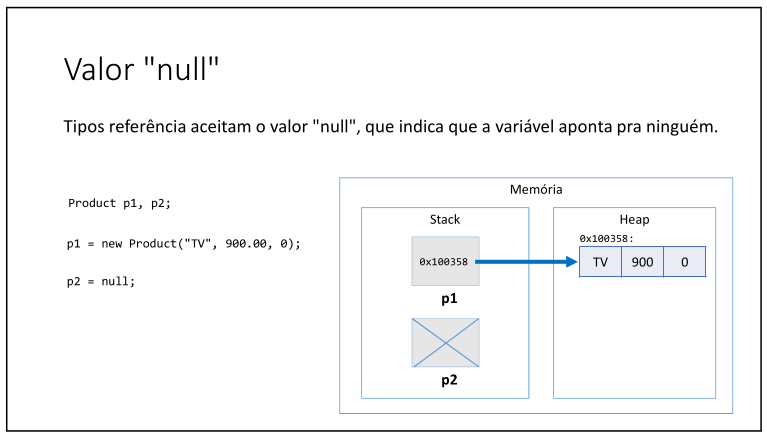

# Aula 094 – Tipos Referência vs. Tipos Valor

Nesta aula foi apresentado um dos conceitos mais importantes para entender o funcionamento do Java: a diferença entre **tipos referência** e **tipos valor (primitivos)**.

Esse entendimento é essencial para compreender comportamento de memória, atribuições, escopo e funcionamento do Garbage Collector.

---

## 94.1 Tipos Referência (Classes)

Em Java, **classes são tipos referência**.

Quando declaramos:

```java
Product p1;
Product p2;
```

Essas variáveis:

- São alocadas na área de memória chamada **stack**
- **Não armazenam o objeto em si**
- Armazenam um **endereço de memória** (referência) para objetos que estão na **heap**

### 94.1.1 Alocação dinâmica

Ao executar, exemplo:

```java
p1 = new Product("TV", 900.00, 10);
```

O que acontece:

1. Um objeto é criado dinamicamente na **heap**
2. A variável `p1` recebe o endereço de memória desse objeto
3. Dizemos que `p1` aponta para o objeto

Por isso variáveis de tipo classe são chamadas de:

- Referências
- Ponteiros (conceito didático)
- "Tentáculos" que apontam para objetos

---

### 94.1.2 Atribuição entre Variáveis Referência

Considere `p1` e `p2` do tipo `Product`, ou seja, seus tipos são classes. E ao fazer o seguinte:

```java
p2 = p1;
```

Nesse caso:

- **Nenhum objeto é copiado**
- `p2` passa a apontar para o **mesmo objeto** que `p1`

Ou seja, agora ambas as variáveis referenciam o mesmo endereço na heap.

Consequência importante:

- Alterações feitas pelo `p1` afetam o objeto visto por `p2`
- Existe apenas **um único objeto**

**Veja a seguinte imagem para entender melhor**:


> **0x100358** é o endereço onde está o objeto criado, `p1` e `p2` guardam/apontam esse endereço

---

### 94.1.3 Valor Nulo (`null`)

Tipos referência aceitam o valor `null`.

```java
Product p2 = null;
```

Isso significa:

- A variável existe na stack
- Mas **não aponta para nenhum objeto**

`null` representa ausência de referência.

Segue a imagem para melhor entendimento:



---

## 94.2 Tipos Primitivos (Tipos Valor)

Os tipos primitivos são **tipos valor**.

Exemplo:

```java
int x = 10;
```

Nesse caso:

- A variável é alocada na **stack**
- O valor `10` é armazenado **diretamente dentro da variável**
- Não existe objeto na heap

---

### 94.2.1 Atribuição entre Tipos Primitivos

Considere:

```java
int x = 10;
int y = x;
```

Aqui:

- O valor de `x` é copiado para `y`
- Cada variável possui sua própria cópia

Se depois fizermos:

```java
x = 20;
```

`y` continuará valendo `10`.

> Diferente do tipo referência, aqui ocorre **cópia de valor**, não compartilhamento.

---

### 94.2.2 Os 8 Tipos Primitivos do Java

O Java possui oito tipos primitivos:

- boolean
- byte
- short
- int
- long
- float
- double
- char

Todos são armazenados diretamente na stack.  
Para mais detalhes rever a [aula 022 - Váriaveis e Tipos Básicos](../../../curso_java/secao04_estrutura_sequencial/aula022_variaveis_e_tipos_basicos/aula022_variaveis_e_tipos_basicos.md)

---

### 94.2.3 Inicialização de Variáveis Primitivas

Se uma variável local primitiva não for inicializada, ocorre erro de compilação:

```java
int p;
System.out.println(p); // ERRO
```

Erro: variável pode não ter sido inicializada.

O compilador exige que variáveis locais tenham valor definido antes do uso.

---

## 94.3 Instanciação de Objeto: Valor Padrão

Quando um objeto é instanciado com `new`, seus atributos recebem **valores padrão**, caso não sejam explicitamente inicializados.

Valores padrão:

| Tipo                              | Valor padrão |
| --------------------------------- | ------------ |
| numéricos (`int`, `double`, etc.) | `0`          |
| `boolean`                         | `false`      |
| `char`                            | `'\u0000'`   |
| objetos (ex: `String`)            | `null`       |

Exemplo:

```java
Product p = new Product();
```

Se não houver inicialização explícita:

- `name` → `null`
- `price` → `0.0`
- `quantity` → `0`

---

## 94.4 Comparação Final: Referência vs Tipo Primitivo

| Característica | Tipo Referência                    | Tipo Primitivo         |
| -------------- | ---------------------------------- | ---------------------  |
| Exemplos       | Classes                            | `int`, `double`, etc.  |
| Armazenamento  | Stack (referência) + Heap (objeto) | Stack (valor direto)   |
| Atribuição <br> Entre as Variáveis  <br> `x = y`   | Compartilha referência <br> `x` passa apontar para onde `y` aponta         | Copia valor <br> `x` passa a ter o mesmo valor que `y`           |
| Aceita `null`  | Sim                                | Não                    |
| Instanciação   | Necessita `new`                    | Não usa `new`          |
| Desalocação    | Garbage Collector (heap)           | Final do escopo (stack)|

---

## 94.5 Conclusão

- Classes são **tipos referência**
- Variáveis de classe armazenam **endereços de memória**
- Primitivos são **tipos valor**
    - Armazenam o valor diretamente na variável
- Atribuição entre referências compartilha objeto
- Atribuição entre primitivos copia valor

---