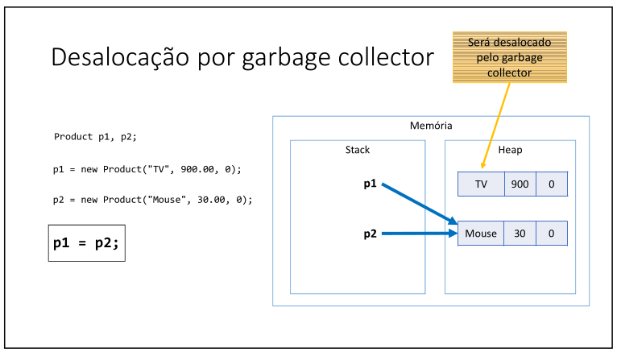
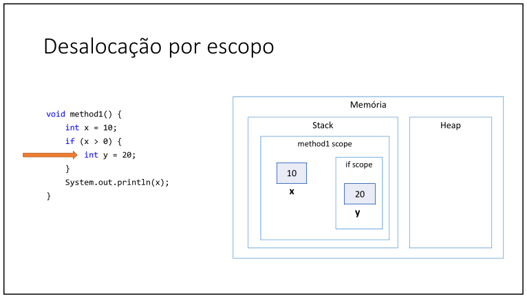
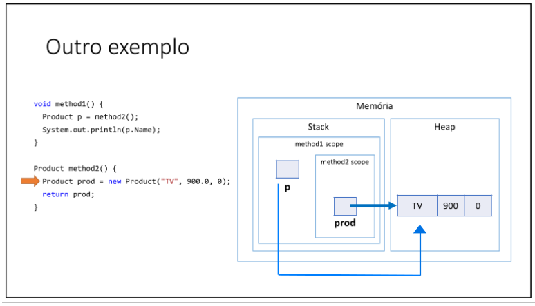

# Aula 095 – Desalocação de Memória: Garbage Collector e Escopo Local

Nesta aula foi explicado como funciona a **desalocação de memória em Java**, abordando:

- O funcionamento do **Garbage Collector**
- A desalocação de variáveis por **escopo local**

---

## 95.1 Garbage Collector

O **Garbage Collector (GC)** é um processo que **automatiza o gerenciamento de memória** de um programa em execução.

Ele atua na **heap**, monitorando os objetos criados dinamicamente com `new`.

### Como ele funciona?

O Garbage Collector:

- Verifica quais objetos ainda possuem referência
- Identifica objetos que **perderam todas as referências**
- Libera a memória desses objetos em um momento futuro

**Exemplo Conceitual**

Considere:

```java
Product p1 = new Product("TV", 900.0, 10);
Product p2 = new Product("Mouse", 50.0, 5);
```

Temos dois objetos na heap:

- `p1` aponta para o primeiro objeto
- `p2` aponta para o segundo objeto

Agora:

```java
p1 = p2;
```

O que acontece?

- `p1` deixa de referenciar o objeto anterior e passa a referenciar o mesmo objeto que `p2`
    - Como não existe mais nenhuma variável apontando para o primeiro objeto criado, ele se torna inalcançável
O objeto que era apontado por `p1` se torna um objeto elegível para o Garbage Collector, já que não tem mais ninguém apontando para ele

> Objeto sem referência → será removido pelo GC em um momento futuro.

**Veja a explicação através de imagem**:



---

## 95.2 Desalocação por Escopo Local

Diferente da heap, variáveis locais são armazenadas na **stack**.

Elas não dependem do Garbage Collector.

### Regra fundamental:

Quando o escopo termina, as variáveis locais são **desalocadas imediatamente**.

**Exemplo com Bloco `if`**

```java
void method1() {
    int x = 10;

    if (x > 0) {
        int y = 20;
    }

    System.out.println(x);
}
```

O que acontece:

- `x` existe durante todo o método
- `y` existe apenas dentro do bloco if
- Ao sair do `if`, `y` é removida imediatamente da stack
- Ao terminar a execução de todo o método, `x` é removido da stack

Aqui **não há atuação do Garbage Collector**.

**Veja a explicação através de imagem:**



---

## 95.3 Exemplo com Retorno de Método

Considere:

```java
public static Product method2() {
    Product prod = new Product("TV", 900.0, 10);
    return prod;
}
```

E no método principal:

```java
public void method1() {
    Product p = method2();
}
```

Fluxo:

- A variável local `p` é criada na **stack** quando |`method1()` inicia
- O método `method2()` é chamado, criando um novo frame na stack
- Dentro de `method2()`, a variável local `prod` é criada na stack
- A instrução `new Product("TV", 900.0, 10)` cria um objeto na **heap**
- A variável `prod` recebe a **referência** para esse objeto
- O método `method2()` retorna essa referência
- A variável `p` recebe essa mesma referência
- O escopo de `method2()` termina
    - O frame de `method2()` é removido da stack
    - A variável `prod` deixa de existir
- O objeto **permanece na heap**, pois ainda é alcançável por meio da variável `p`

**Importante:**

- Como vimos, o objeto **não é removido**
- Ele continua existindo porque `p` ainda aponta para ele

Ou seja, mesmo que o escopo local termine, o objeto permanece se ainda houver referência ativa.

**Veja através de imagem**:



---

## 95.4 Resumo Final

- Objetos criados com `new` são alocados na **heap**
- O **Garbage Collector** remove objetos que não possuem mais referências
- A remoção não é imediata, ocorre em momento oportuno
- Variáveis locais ficam na **stack**
- Ao final do escopo, variáveis locais são removidas imediatamente
- Se um objeto ainda possui referência, ele continua existindo

---