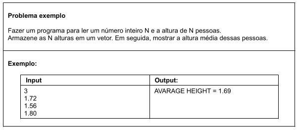

# Aula 096 – Vetores (Tipos Primitivos)

Nesta aula estudamos **vetores em Java**, revisando o conceito teórico e aplicando na prática com um exemplo utilizando elementos do tipo primitivo (`double`).

O conteúdo abordado inclui:

- Revisão do conceito de vetor (array)
- Declaração e instanciação de vetores em Java
- Acesso aos elementos
- Propriedade `length`
- Percurso com estrutura `for`
- Exemplo prático com cálculo de média

---

## 96.1 Revisão Teórica – O que é um Vetor?

Em programação, vetor (array) é o nome dado a um **arranjo unidimensional**.

Um array possui as seguintes características:

### 96.1.1 Estrutura homogênea

Todos os elementos são do **mesmo tipo**.

**Exemplo**:

- int[]
- double[]
- String[]
- Product[]

Não é permitido misturar tipos dentro do mesmo vetor.

---

### 96.1.2 Estrutura indexada (ordenada)

Os elementos são acessados por meio de **índices numéricos**, iniciando em **0**.

**Exemplo para um vetor com 3 posições**:

```text
Índices:   0   1   2
Valores:  ___ ___ ___
```

Se o vetor tem `n` elementos, seus índices vão de:

```text
0 até n - 1
```

---

### 96.1.3 Alocação contígua de memória

Quando um vetor é instanciado, todas as posições são alocadas de uma só vez, em um **bloco contíguo de memória na heap**.

**Exemplo**:

```java
double[] vet = new double[3];
```

Nesse momento:

- 3 posições são reservadas
- Todas são criadas simultaneamente
- O tamanho é fixo

---

## 96.2 Vantagens e Desvantagens

**1. Vantagem – Acesso Direto (O(1))**

O acesso a qualquer posição é imediato.

Se quisermos o elemento da posição 500.000 em um vetor com 1 milhão de posições:

```java
vet[500000];
```

Não é necessário percorrer os anteriores.

Isso ocorre porque o endereço do elemento é calculado diretamente pela posição.

---

**2. Desvantagem 1 – Tamanho Fixo**

O tamanho precisa ser definido no momento da criação:

```java
double[] vet = new double[100];
```

Não é possível aumentar ou diminuir o tamanho depois.

Para alterar o tamanho, seria necessário criar outro vetor e copiar os elementos.

---

**3. Desvantagem 2 – Inserções e Remoções Custosas**

Ao remover um elemento intermediário, é necessário deslocar os elementos posteriores.

Exemplo:

```text
índices:    0        1       2    ...
valores: [valor1, valor2, valor3, ...]
```

Se removermos o elemento de índice 2, todos os elementos após ele precisam ser movidos uma posição para a esquerda para "tampar o buraco" que ficou após a retirada do elemento do índice 2.

Isso torna operações de inserção e remoção menos eficientes.

---

## 96.3 Exemplo Prático – Altura Média



---

### 96.3.1 Código Completo

[Ir para o código](../../../workspace/aula096_exemplo01_vetor_de_alturas/src/application/Program.java)

---

### 96.3.2 pontos importantes do código:

---

#### 96.3.2.1 Declaração e Instanciação do Vetor

Quando escrevemos:

```java
double[] heightVector = new double[size];
```

Temos dois acontecimentos distintos na memória:

- `new double[size]`

    - O objeto array é criado na **Heap**
    - Um bloco contíguo de memória é alocado
    - Cada posição recebe valor padrão `0.0`

- `double[] heightVector`
    - A variável `heightVector` é criada na **Stack**
    - Ela armazena apenas a **referência (endereço)** do objeto criado na Heap

**Resumo**

- **Stack** → guarda a referência
- **Heap** → guarda o objeto array e seus elementos

Isso segue o mesmo princípio visto anteriormente com objetos criados com `new`.

---

#### 96.3.2.2 Percorrendo o Vetor com for

Usamos um for para percorrer os índices do vetor: 

```java
for (int i = 0; i < size; i++) {
    heightVector[i] = scan.nextDouble();
}
```

Dessa forma, para cada índice, será atribuido uma altura.  
A cada iteração `i`é incrementado (passando para o próximo índice).  
Usamos a mesma ideia para somar as alturas.

---

## 96.4 Resumo Final

- Vetor é uma estrutura homogênea e indexada.
- É alocado de forma contígua na memória.
- O tamanho é fixo após a criação.
- O acesso aos elementos é direto (O(1)).
- Elementos do tipo primitivo recebem valor padrão automaticamente.
- Percorremos vetores geralmente com `for` iniciando em índice 0.

> Vetores são objetos em Java.  
Mesmo armazenando tipos primitivos, o vetor em si é um objeto.

---
