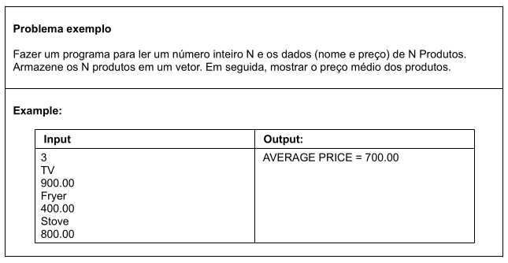

# Aula 097 - Vetores (Parte 2 - Tipo Referência)

Na aula anterior trabalhamos com vetores de tipos primitivos.

Agora surge uma pergunta importante:

> E se quisermos armazenar estruturas mais complexas que números?

Por exemplo:  
Um produto tem nome e preço.  
Um único `double` não é suficiente.

É aqui que entram os **vetores de tipo referência**.

---

## 97.1 O Problema



A diferença desse problema para o da aula passada é que agora não vamos armazenar double (tipo primitivo), mas **objetos**.

---

## 97.2 Revisão Rápida – Vetor de Tipo Primitivo

Quando fazemos:

```java
double[] vect = new double[3];
```

### 97.2.1 O que acontece na Memória?

Diferente de objetos, os **tipos primitivos** no array, são alocados em um bloco contíguo na memória.

- **Stack**: A variável `vect` guarda o endereço de memória para o vetor.
- **Heap**: Onde os dados realmente residem.

```text
       STACK          HEAP (Memória Principal)
      [ vect ] ----> [ 0.0 | 0.0 | 0.0 ]
                       0     1     2  (índices)
```

#### Pontos Chaves:

- **Valor Padrão**: O Java inicializa automaticamente cada posição com o valor padrão do tipo (para `double`, é `0.0`).
- **Armazenamento Direto**: Cada posição do vetor guarda o valor real (o dado), e não um ponteiro/referência para outro lugar.

> **Nota**: Não é necessário usar a palavra-chave `new` para cada elemento individual, apenas para criar o vetor em si.

---

## 97.3 Vetor de Tipo Referência (classe)

Diferente dos tipos primitivos, quando trabalhamos com objetos, a memória funciona em **dois níveis**.

```java
Product[] vect = new Product[3];
```

### 97.3.1 O Estado Inicial na Memória

Neste momento, é criado o **"armário"** (o vetor), mas as **"gavetas"** estão vazias:

```text
       STACK          HEAP (Memória Principal)
      [ vect ] ----> [ null | null | null ]
                       0       1      2     (índices)
```

#### A diferença crítica:

- **O Vetor já existe**: Ele é um objeto que ocupa espaço no Heap (assim como quando é um vetor de primitivo).

- **Os Elementos não existem**: Cada **posição** guarda apenas um **"espaço reservado" (referência)** que, por padrão, aponta para nada (`null`).

---

### 97.3.2 A Instanciação dos Elementos

Para que o vetor tenha dados reais, precisamos instanciar cada objeto individualmente:

```java
vect[0] = new Product("TV", 900.0); // Objeto instaciado na posição zero
```

Agora, a memória se transforma nisso:

```text

       STACK              HEAP
      [ vect ] ----> [ obj1 | null | null ]
                        |
                        +--> [ "TV", 900.0 ] (Objeto Product real)
```

### 97.3.3 Resumo da Estrutura

Em Java, um vetor de objetos é, na verdade, um **vetor de referências**.

- **Variável vs. Objeto**:
    - A variável `vect` (na Stack) é apenas uma **referência** que aponta para o **objeto array (vetor)** que foi criado após o `new`.
    - O **objeto array** (no Heap) é quem realmente possui os atributos como o `.length` e as posições (slots).
        - o `.length` retorna o tamanho do vetor

- **A "Dupla Camada" de Referência**:
    - A variável `vect` aponta para o Vetor.
    - Cada posição do vetor aponta para um **Objeto Product** diferente no Heap.

    > **Regra de Ouro**: Se tentarmos acessar `vect[0].getName(` antes de fazer `new Product()`, o Java lançará o `NullPointerException` (ainda vamos falar sobre exceções).  
    Isso acontece porque estamos tentando "seguir o caminho" de uma referência que ainda aponta para lugar nenhum (`null`).

---

## 97.4 Modelando a Classe `Product`

Antes de criar o vetor, precisamos definir o "molde" dos nossos objetos.  
A classe `Product` encapsula os dados (`name` e `price`) e fornece os métodos para acessá-los.

**Por que isso é importante?**

- **Encapsulamento**: Os atributos são `private`, garantindo que o acesso ao preço e nome seja feito apenas via métodos como `get` e `set`.
- **Tipo Customizado**: Ao criar essa classe, estamos dizendo ao Java que `Product` agora é um tipo válido, assim como `int` ou `double`, mas que funciona por referência.

---

## 97.5 Implementação e Ciclo de Vida na Memória

Vamos ver como tudo se encaixa no `main`. O segredo aqui é entender que o preenchimento do vetor acontece em **duas etapas**.

```java
public static void main(String[] args) {
    Locale.setDefault(Locale.US);
    Scanner scan = new Scanner(System.in);

    int n = scan.nextInt();
    Product[] vect = new Product[n]; // ETAPA 1: Criar o "armário" (tudo null)

    for (int i = 0; i < vect.length; i++) {
        scan.nextLine(); // Consumir quebra de linha
        String name = scan.nextLine();
        double price = scan.nextDouble();

        // ETAPA 2: Criar o "conteúdo" (instanciação)
        vect[i] = new Product(name, price); 
    }

    double sum = 0.0;
    for (int i = 0; i < vect.length; i++) {
        // Acessando o objeto através da referência guardada no vetor
        sum += vect[i].getPrice(); 
    }

    double avg = sum / vect.length;
    System.out.printf("AVERAGE PRICE = %.2f%n", avg);
    scan.close();
}
```

### 97.5.1 Entendendo o acesso: `vect[i].get`...

Para acessar os dados de um objeto dentro de um vetor, usamos a sintaxe de dois passos:

1. **vect[i]**: Localiza qual posição do vetor queremos.
2. `.metodo()`: Como cada posição guarda um objeto `Product`, temos acesso a todos os **métodos públicos** da classe.

**Exemplo**:

```java
double p = vect[i].getPrice(); 
```

> _Cuidado: Se esquecer a instanciação com `new`, o vect[i] estará nulo e o `.getPrice()` causará um erro fatal._

---

## 97.6 O que você não pode esquecer (Checklist Técnico)

Para evitar os erros mais comuns (como o `NullPointerException`), foque nestes três pontos:

1. **O atributo `.length`**:  
Prefira sempre `vect.length` em vez de usar alguma variável representando o tamanho.  
Isso torna o código "autossuficiente" — o vetor sabe o próprio tamanho.

2. O **"New"** Duplo:
    - O 1º `new` cria o array
    - O 2º `new` (no nosso caso dentro do for) cria cada objeto.
        - Sem esse segundo `new`, vai ter um array de nadas.
    
3. **Garbage Collector**:  
Se fizermos `vect[i] = null`, a referência para aquele produto é perdida.  
E se não houver outra variável apontando para ele, o objeto se torna elegível  
para o **Garbage Collector**, que poderá remover esse objeto da memória.

---

## 97.7 Resumo Comparativo Final

| Característica        | Tipo Primitivo (`double[]`)        | Tipo Referência (`Product[]`)              |
|----------------------|----------------------------------|------------------------------------------|
| Conteúdo do Slot     | Valor real (ex: `10.5`)            | "Endereço de memória" (Referência)         |
| Valor Inicial        | Zero (`0.0`, `0`, etc) <br> depende do tipo               | Nulo (`null`)                              |
| Instanciação         | Apenas do vetor                  | Do vetor e de cada objeto                |
| Risco Principal      | Cálculos errados                 | `NullPointerException`                     |

---

## 97.8 Código Completo

- [Classe Product](../../../workspace/aula097_exemplo02_vetor_de_referencia/src/entities/Product.java)
- [Classe Principal](../../../workspace/aula097_exemplo02_vetor_de_referencia/src/application/Program.java)

---