# Aula 098 a 102 – Exercícios de Fixação sobre Vetores

Após estudarmos os fundamentos de **vetores (arrays)**, chegou o momento de consolidar esse conteúdo por meio de exercícios práticos.

Nesta etapa, o foco é **treinar a manipulação básica de vetores**, antes de avançarmos para novos tópicos do curso.

Os exercícios utilizados nesta aula foram disponibilizados no material de apoio da plataforma **DevSuperior**:  
https://devsuperior.com.br

Os exercícios de fixação são apresentados em **ordem crescente de dificuldade**, permitindo a evolução gradual:

- Iniciando com exercícios mais simples (um único vetor).
- Avançando para problemas com dois ou mais vetores.
- Trabalhando leitura, processamento e exibição de dados.

---

## 98.1 Objetivo desta etapa

O objetivo principal é fortalecer a base sobre:

- Declaração e instanciação de vetores.
- Leitura de dados com estrutura de repetição.
- Percorrer vetores com `for`.
- Uso de acumuladores.
- Comparações (maior, menor, média).
- Manipulação de múltiplos vetores paralelos.

---

## 98.2 Observações Importantes

Nesta lista de exercícios, vamos resolver os problemas de duas formas:

**1.** Tratando os dados de forma simples (tipos primitivos), sem o uso de classes.

- Em problemas que envolvem múltiplas informações relacionadas (como nome, idade e altura), pode ser tomada a seguinte abordagem:
    - Criar um vetor para cada tipo de dado
        - `String[]` para nomes
        - `int[]` para idades
        - `double[]` para alturas
    - Manter a correspondência entre eles por meio do índice

**2.** Modelando classe e utilizando um vetor de objetos

> A segunda forma, com a criação de classes, será realizada apenas para problemas que fazem sentido seu uso.

Em alguns exercícios, optei por implementar tanto a abordagem procedural quanto a orientada a objetos, com o objetivo de comparar a modelagem de dados e a distribuição de responsabilidades.

---

# 98-102.1 Exercícios de Fixação

## 98-102.1.1 Negativos

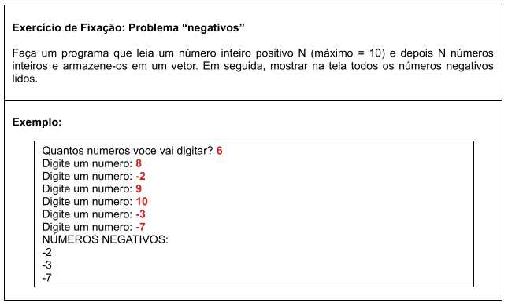

- **Meu Algoritmo com a Resolução para esse Problema:**  

[Ver Algoritmo](../../../workspace/aula098a102_problema01_negativos/src/application/Program.java)

---

## 98-102.1.2 Soma Vetor

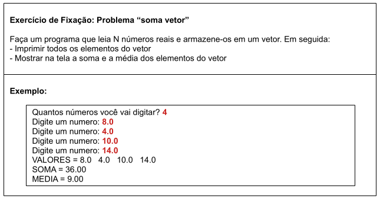

- **Meu Algoritmo com a Resolução para esse Problema:**  
[Ver Algoritmo](../../../workspace/aula098a102_problema02_soma_vetor/src/application/Program.java)

---

## 98-102.1.3 Alturas

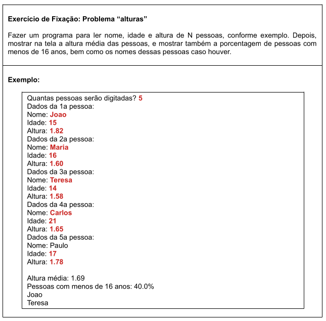

**Estrutura do projeto e implementação da solução:**

- _application_
    - _oo_
        - [_Program.java_](../../../workspace/aula098a102_problema03_alturas/src/application/oo/Program.java)
    - _procedural_
        - [_Program.java_](../../../workspace/aula098a102_problema03_alturas/src/application/procedural/Program.java)
- _entities_
    - [_Person.java_](../../../workspace/aula098a102_problema03_alturas/src/entities/Person.java)
- _util_
    - [_PersonArrayUtils.java_](../../../workspace/aula098a102_problema03_alturas/src/util/PersonArrayUtils.java)

---

## 98-102.1.4 Números Pares

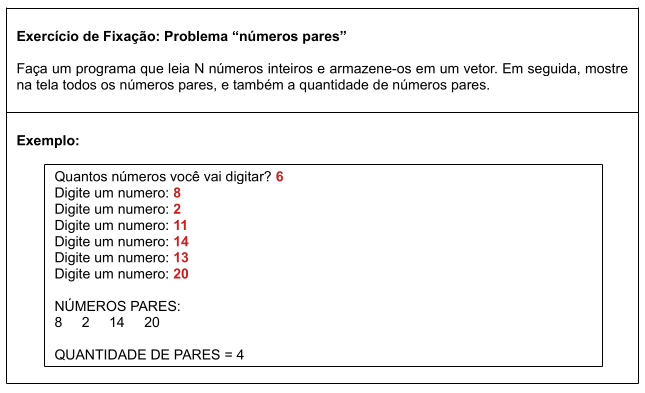

- **Meu Algoritmo com a Resolução para esse Problema:**  
[Ver Algoritmo](../../../workspace/aula098a102_problema04_numeros_pares/src/application/Program.java)

---

## 98-102.1.5 Maior Posição

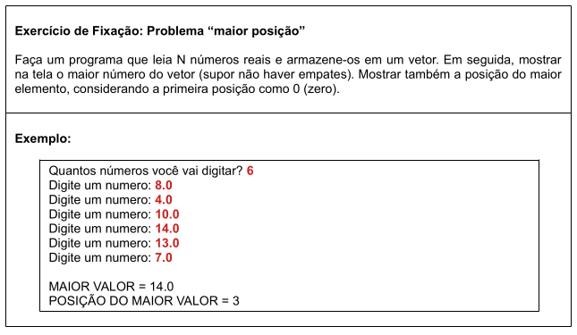

- **Meu Algoritmo com a Resolução para esse Problema:**  
[Ver Algoritmo](../../../workspace/aula098a102_problema05_maior_posicao/src/application/Program.java)

---

## 98-102.1.6 Soma Vetores

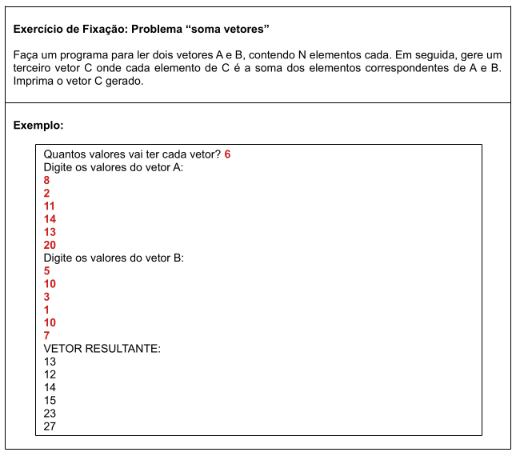

**Estrutura do projeto e implementação da solução:**  

- _application_
    - _oo_
        - [_Program.java_](../../../workspace/aula098a102_problema06_soma_vetores/src/application/oo/Program.java)
    - _procedural_
        - [_Program.java_](../../../workspace/aula098a102_problema06_soma_vetores/src/application/procedural/Program.java)
- _entities_
    - [_Vector.java_](../../../workspace/aula098a102_problema06_soma_vetores/src/entities/Vector.java)
- _util_
    - [_VectorOperations.java_](../../../workspace/aula098a102_problema06_soma_vetores/src/util/VectorOperations.java)

---

## 98-102.1.7 Abaixo da Média

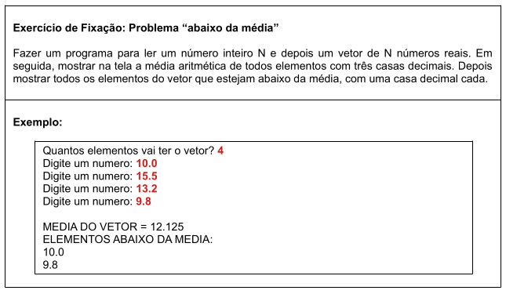

- **Meu Algoritmo com a Resolução para esse Problema:**  
[Ver Algoritmo](../../../workspace/aula098a102_problema07_abaixo_da_media/src/application/Program.java)

---

## 98-102.1.8 Média Pares

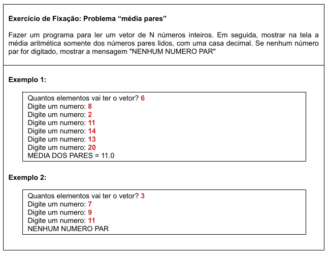

- **Meu Algoritmo com a Resolução para esse Problema:**  
[Ver Algoritmo](../../../workspace/aula098a102_problema08_media_pares/src/application/Program.java)

---

## 98-102.1.9 Mais Velho

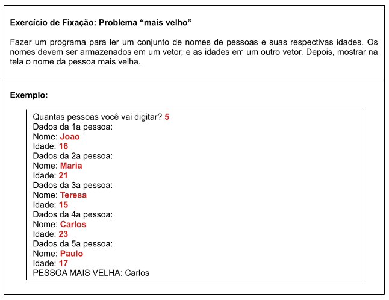

**Estrutura do projeto e implementação da solução:**  

- _application_
    - _oo_
        - [_Program.java_](../../../workspace/aula098a102_problema09_mais_velho/src/application/oo/Program.java)
    - _procedural_
        - [_Program.java_](../../../workspace/aula098a102_problema09_mais_velho/src/application/procedural/Program.java)
- _entities_
    - [_Person.java_](../../../workspace/aula098a102_problema09_mais_velho/src/entities/Person.java)
- _util_
    - [_PersonArrayUtils.java_](../../../workspace/aula098a102_problema09_mais_velho/src/util/PersonArrayUtils.java)

---

## 98-102.1.10 Aprovados

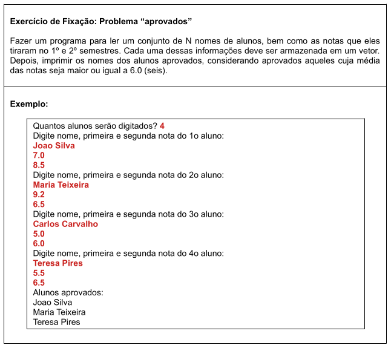

**Estrutura do projeto e implementação da solução:**  

- _application_
    - _oo_
        - [_Program.java_](../../../workspace/aula098a102_problema10_aprovados/src/application/oo/Program.java)
    - _procedural_
        - [_Program.java_](../../../workspace/aula098a102_problema10_aprovados/src/application/procedural/Program.java)
- _entities_
    - [_Student.java_](../../../workspace/aula098a102_problema10_aprovados/src/entities/Student.java)
- _util_
    - [_StudentUtils.java_](../../../workspace/aula098a102_problema10_aprovados/src/util/StudentUtils.java)

---

## 98-102.1.11 Dados Pessoas

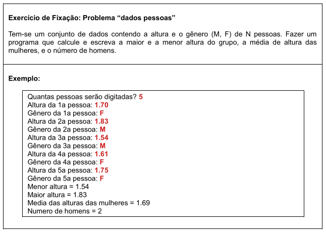

**Estrutura do projeto e implementação da solução:** 

- _application_
    - _oo_
        - [_Program.java_](../../../workspace/aula098a102_problema11_dados_pessoais/src/application/oo/Program.java)
    - _procedural_
        - [_Program.java_](../../../workspace/aula098a102_problema11_dados_pessoais/src/application/procedural/Program.java)
- _entities_
    - [_Person.java_](../../../workspace/aula098a102_problema11_dados_pessoais/src/entities/Person.java)
- _util_
    - [_PersonStatistics.java_](../../../workspace/aula098a102_problema11_dados_pessoais/src/util/PersonStatistics.java)

---

## 98-102.2 Desafio sobre vetores (Pensionato)

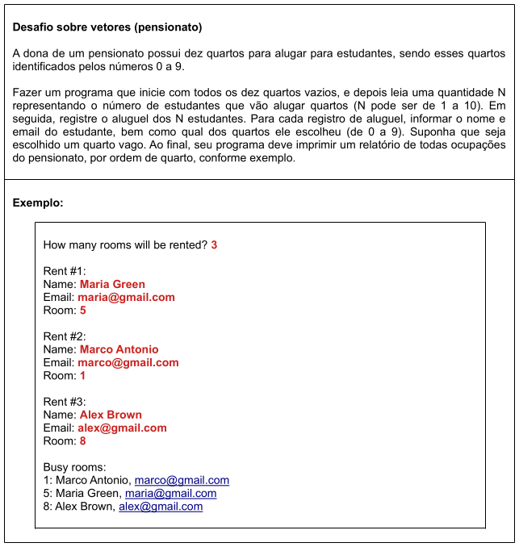

**Estrutura do projeto e implementação da solução:**

- _application_
   - [_Program.java_](../../../workspace/aula098a102_problema12_desafio/src/application/Program.java)
- _entities_
    - [_BoardingHouse.java_](../../../workspace/aula098a102_problema12_desafio/src/entities/BoardingHouse.java)
    - [_Room.java_](../../../workspace/aula098a102_problema12_desafio/src/entities/Room.java)
    - [_Student.java_](../../../workspace/aula098a102_problema12_desafio/src/entities/Student.java)

