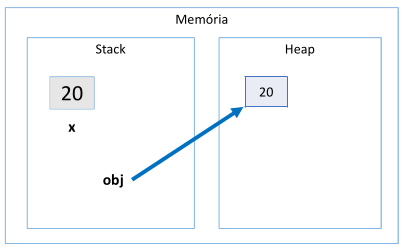

# Aula 103 – Boxing, Unboxing e Wrapper Classes

Nesta aula, foram apresentados três conceitos importantes da linguagem Java:

- **Boxing**
- **Unboxing**
- **Wrapper Classes**

Esses conceitos explicam como o Java realiza **conversões entre tipos primitivos e objetos**, permitindo que valores primitivos sejam tratados como instâncias de classes.

---

## 103.1 Boxing

**Boxing** é o processo de conversão de um **tipo primitivo** (*value type*) para um **objeto** (*reference type*) compatível.

Em outras palavras, ocorre quando um valor primitivo é **encapsulado dentro de um objeto**.

### Exemplo

```java
int x = 20;
Object obj = x;
```

> internamente o java faz isso: Object obj = Integer.valueOf(x);

Nesse exemplo:

- `x` é uma variável do **tipo primitivo** `int`
- `obj` é uma variável do tipo `Object`, que é uma **classe**

Quando `obj` recebe `x`, o Java **automaticamente cria um objeto** contendo o valor `20`, e a variável `obj` passa a referenciar esse objeto.

### Representação conceitual na memória



Ou seja:

- `x` **armazena diretamente o valor**
- `obj` **armazena uma referência** para um objeto que contém o valor

Esse processo de **empacotar um valor primitivo dentro de um objeto** é chamado de **boxing**.

---

## 103.2 Unboxing

**Unboxing** é o processo **inverso** do boxing.

Ele ocorre quando um objeto é **convertido novamente para um tipo primitivo** compatível.

### Exemplo

```java
int x = 20;
Object obj = x;     // boxing

int y = (int) obj;  // unboxing
```

Aqui acontece o seguinte:

- `x` recebe o valor `20`
- `obj` recebe `x` → ocorre **boxing**
- `y` recebe `obj` → ocorre **unboxing**

Nesse caso, é necessário utilizar **cast**:

```java
(int) obj
```

> ⚠️ Sem esse cast, o compilador gera **erro**, pois `Object` não é automaticamente considerado um `int`.

### Saída do programa

```java
System.out.println(obj);
System.out.println(y);
```

```
20
20
```

---

## 103.3 Wrapper Classes

Java possui **classes equivalentes para cada tipo primitivo**, chamadas de **Wrapper Classes**.

Essas classes permitem que **valores primitivos sejam tratados como objetos**.

### Tipos primitivos e suas Wrapper Classes

| Tipo primitivo | Wrapper Class |
|----------------|---------------|
| `boolean`      | `Boolean`     |
| `char`         | `Character`   |
| `byte`         | `Byte`        |
| `short`        | `Short`       |
| `int`          | `Integer`     |
| `long`         | `Long`        |
| `float`        | `Float`       |
| `double`       | `Double`      |

Essas classes existem justamente para **facilitar o uso de boxing e unboxing** na linguagem.

---

## 103.4 Autoboxing e Auto-unboxing

Quando utilizamos **Wrapper Classes**, o Java realiza **automaticamente** as conversões entre **primitivos e objetos**.

### Exemplo

```java
int x = 20;

Integer obj = x; // autoboxing

int y = obj;     // auto-unboxing
```

Diferente do caso anterior, **não é necessário cast explícito** no unboxing.  
O compilador Java faz a conversão automaticamente.

### 103.4.1 Uso em expressões

Wrapper Classes também podem ser utilizadas diretamente em operações:

```java
Integer obj = 20;

int result = obj * 2;

System.out.println(result);
```

Saída:

```
40
```

Nesse caso, o Java realiza **auto-unboxing** automaticamente para executar a operação aritmética.

---

## 103.5 Por que Wrapper Classes existem?

Wrapper Classes são importantes porque **tipos primitivos possuem limitações**.

**Tipos primitivos:**

- **Não aceitam valor** `null`
- Não possuem **métodos**
- Não podem participar diretamente de **recursos de orientação a objetos**

**Wrapper Classes, por outro lado:**

- São **objetos**
- Podem receber valor `null`
- Suportam **herança**, **polimorfismo** e outros recursos da **POO**

---

## 103.6 Uso comum em sistemas de informação

Um uso muito comum das Wrapper Classes ocorre em **entidades de sistemas que interagem com banco de dados**.

### Exemplo

```java
public class Product {

    public String name;
    public Double price;
    public Integer quantity;

}
```

Nesse caso, foram utilizadas **Wrapper Classes** (`Double`, `Integer`) em vez dos tipos primitivos (`double`, `int`).

### Motivo

Wrapper Classes permitem que o atributo receba valor **`null`**.

Isso é importante porque:

- Em bancos de dados, **campos podem ser nulos**
- O objeto Java precisa **representar esse mesmo estado**

### Exemplo prático

Imagine um cadastro de usuário onde a **data de nascimento é opcional**.

Nesse caso, o atributo precisa aceitar `null`, e se fosse um **tipo primitivo**, isso não seria possível.

---

## 103.7 Conclusão

Nesta aula foram apresentados conceitos fundamentais relacionados à **conversão entre tipos primitivos e objetos** em Java.

### Principais pontos

| Conceito | Descrição |
|----------|-----------|
| **Boxing** | Conversão de tipo primitivo para objeto |
| **Unboxing** | Conversão de objeto para tipo primitivo |
| **Wrapper Classes** | Classes equivalentes aos tipos primitivos |
| **Autoboxing / Auto-unboxing** | Conversões automáticas realizadas pelo compilador |

Esses mecanismos são amplamente utilizados no desenvolvimento Java moderno, principalmente em **APIs**, **coleções** e **mapeamento de dados** em sistemas de informação.