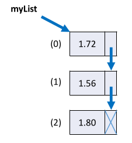
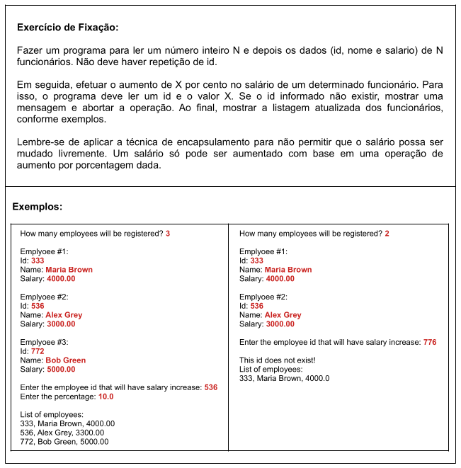

# Aula 105 – Listas (Parte 1)

Listas são um dos conceitos mais importantes de estruturas de dados em Java. Elas permitem armazenar coleções de elementos de forma **dinâmica**, com muito mais flexibilidade do que vetores.

> Esta aula cobre os **conceitos teóricos**. A Parte 2 aborda o uso prático em Java.

---

## 105.1 O que é uma lista

Uma lista é uma estrutura de dados **homogênea** e **ordenada**:

- **Homogênea** → armazena elementos do **mesmo tipo**
- **Ordenada** → cada elemento possui uma **posição definida** (índice), começando em `0`

```
Posição:  0       1      2
Valor:  "Maria"  "Bob"  "Alex"
```

---

## 105.2 Vetor vs. Lista

| Característica              | Vetor         | Lista         |
|-----------------------------|:-------------:|:-------------:|
| Tamanho                     | Fixo          | **Dinâmico**  |
| Definido na criação         | ✅            | ❌            |
| Inicia vazio                | ❌            | ✅            |
| Inserção/remoção fácil      | ❌            | ✅            |

**Vetor** — tamanho definido na criação e imutável:

```java
int[] vect = new int[10]; // sempre 10 posições
```

**Lista** — cresce e diminui sob demanda, sem tamanho fixo.

---

## 105.3 Estrutura interna: lista encadeada

Conceitualmente, uma lista é representada como uma **lista encadeada** (*linked list*).

Cada elemento é chamado de **nó** (*node*) e contém:
- o **valor** armazenado
- uma **referência para o próximo nó**



O último nó aponta para `null`, indicando o **fim da lista**.

---

## 105.4 O tipo `List` em Java

Em Java, `List` é o tipo utilizado para trabalharmos com listas.  
Entretanto, `List` **não é uma classe — é uma interface**.

Uma interface define *quais* operações existem, mas não *como* são implementadas. Por isso, **não é possível instanciá-la diretamente**:

```java
List<String> list = new List<>(); // ❌ ERRO — interface não pode ser instanciada
```

Para usar uma lista, precisamos de uma **classe que implemente** essa interface, como por exemplo `ArrayList`:

```java
List<String> list = new ArrayList<>(); // ✅ correto
```

Nesse caso:

- `List` define a **interface**
- `ArrayList` fornece a **implementação concreta**

> Esse padrão segue um princípio fundamental da POO:
> **"Programe para a interface, não para a implementação."**

---

## 105.5 Principais implementações de `List`

| Classe         | Estrutura interna | Acesso por índice | Inserção/remoção |
|----------------|:-----------------:|:-----------------:|:----------------:|
| `ArrayList`    | Vetor interno     | ✅ Rápido         | ⚠️ Mais lento   |
| `LinkedList`   | Lista encadeada   | ⚠️ Mais lento    | ✅ Rápida        |

O `ArrayList` é a implementação **mais utilizada** por combinar a flexibilidade das listas com acesso rápido por índice.

---

## 105.6 Vantagens e desvantagem

**Vantagens:**
- **Tamanho dinâmico** — elementos adicionados e removidos livremente
- **Inserção e remoção simples** — operações que são limitadas em vetores

**Desvantagem:**
- Em uma lista encadeada pura, o **acesso por índice é sequencial** — para chegar à posição `500`, é necessário percorrer os `499` elementos anteriores

> O `ArrayList` é uma implementação de `List` que contorna essa limitação com sua estrutura interna baseada em vetor.

---

## 105.7 Conclusão

| Conceito | Resumo |
|----------|--------|
| **Lista** | Estrutura homogênea, ordenada e de tamanho dinâmico |
| **`List`** | Interface Java — não pode ser instanciada diretamente |
| **`ArrayList`** | Implementação mais comum — acesso rápido por índice |
| **`LinkedList`** | Melhor para inserções e remoções frequentes |


---

# Aula 106 – Listas (Parte 2)

Continuação do estudo sobre listas em Java, agora focando na **prática**. Serão demonstradas as operações mais comuns: declaração, instanciação, inserção, remoção, busca e filtragem.

> ⚠️ Alguns conceitos utilizados aqui — como **Generics**, **Streams**, **Predicados** e **Expressões Lambda** — serão aprofundados em aulas futuras. Por enquanto, veremos apenas o necessário para trabalhar com listas.

---

## 106.1 Declarando e instanciando uma lista

Para declarar uma lista em Java utilizamos a interface `List`.

Exemplo de lista de inteiros: 

```java
List<Integer> list = new ArrayList<>();
```

#### Dois pontos importantes:

**1. Listas não aceitam tipos primitivos — apenas objetos:**

```java
List<int> list;     // ❌ ERRO
List<Integer> list; // ✅ correto
```

**2. `List` é uma interface — não pode ser instanciada diretamente:**

```java
List<String> list = new List<>();     // ❌ ERRO
List<String> list = new ArrayList<>(); // ✅ correto
```

O `<>` vazio na instanciação (`new ArrayList<>();`) é chamado de **Diamond Operator**, disponível a partir do Java 7 — o compilador infere o tipo automaticamente.

---

## 106.2 Generics

O tipo entre `< >` é chamado de **Generic Type** e define qual tipo de objeto será armazenado:

```java
List<String>   // lista de Strings
List<Integer>  // lista de inteiros
List<Product>  // lista de objetos Product
```

Generics garantem **segurança de tipos** (*type safety*) em tempo de compilação, evitando erros em tempo de execução.

---

## 106.3 Operações básicas

Devemos utilizar uma classe que implemente a interface `List`, aqui vamos utilizar `ArrayList()`:

```java
List<String> list = new ArrayList<>();
```

### 106.3.1 Adicionando elementos — `add()`

```java
list.add("Maria");
list.add("Alex");
list.add("Bob");
list.add("Anna");
// [Maria, Alex, Bob, Anna]
```

Para inserir em uma **posição específica**, utilizamos uma **sobrecarga** do método `add()`. Ao utilizá-la, os elementos a partir daquele índice são **deslocados para a direita** automaticamente:

```java
list.add(2, "Marco");
// [Maria, Alex, Marco, Bob, Anna]
```

---

### 106.3.2 Tamanho da lista — `size()`

```java
System.out.println(list.size()); // 5
```

---

### 106.3.3 Percorrendo com for-each

```java
for (String x : list) {
    System.out.println(x);
}
```

Saída:

```
Maria
Alex
Marco
Bob
Anna
```

---

### 106.3.4 Removendo elementos

#### 106.3.4.1 Remover por valor — `remove(valor)`

Remove o **primeiro** elemento igual ao valor informado:

```java
// Lista antes:
// [Maria, Alex, Marco, Bob, Anna]

list.remove("Anna");
// [Maria, Alex, Marco, Bob]
```

#### 106.3.4.2 Remover por posição — `remove(índice)`

```java
// Lista antes:
// [Maria, Alex, Marco, Bob]

list.remove(1);
// [Maria, Marco, Bob] -> Alex que estava na posição 1 saiu
```

#### 106.3.4.3 Remover com predicado (condição) - `removeIf()`

Remove todos os elementos que satisfazem um predicado **(expressão lambda)**:

Exemplo: remover nomes que começam com **M**:

```java
// Se a Lista estiver assim:
// [Maria, Marco, Alex, Bob]

list.removeIf(x -> x.charAt(0) == 'M');
// Remove todos que começam com 'M'
// [Alex, Bob]
```

A expressão `x -> x.charAt(0) == 'M'` significa: *"para cada elemento `x`, verifique se o primeiro caractere é `'M'`"*.

---

## 106.4 Buscando elementos

### 106.4.1 Posição de um elemento — `indexOf()`

```java
System.out.println(list.indexOf("Bob")); // 1
```

> Retorna **`-1`** caso o elemento não exista na lista.

---

## 106.5 Filtrando lista com Streams

Streams permitem aplicar **operações funcionais** sobre listas de forma encadeada.

### 106.5.1 Filtrar elementos — `stream().filter()`

Cria uma nova lista com os elementos que atendem a uma condição:

Exemplo: obter apenas nomes que começam com **A**

```java
List<String> result = list.stream()
    .filter(x -> x.charAt(0) == 'A')
    .collect(Collectors.toList());
```

| Passo | Método | Descrição |
|-------|--------|-----------|
| 1 | `stream()` | Converte a lista em um Stream, que permite operações funcionais |
| 2 | `filter(...)` | Aplica o predicado para filtrar elementos |
| 3 | `collect(...)` | Converte o resultado de volta para `List` |

```
Lista original:  [Alex, Bob, Anna]
Lista filtrada:  [Alex, Anna]
```

---

### 106.5.2 Encontrar o primeiro elemento usando predicado — `findFirst()`

Podemos buscar o **primeiro elemento que atenda uma condição**.

Exemplo: encontrar o primeiro nome que começa com **A**.

```java
String name = list.stream()
    .filter(x -> x.charAt(0) == 'A')
    .findFirst()
    .orElse(null);
```

- **`filter(...)`** → Filtra os elementos que satisfazem o predicado
- **`findFirst()`** → retorna o primeiro elemento que passou pelo filtro
- **`orElse(null)`** → retorna `null` caso nenhum elemento seja encontrado

```
Lista: [Alex, Bob, Anna]  →  Resultado: "Alex"
Lista: [Bob, Carol]       →  Resultado: null
```

---

## 106.6 Principais métodos utilizados

| Método | Descrição |
|--------|-----------|
| `add(element)` | Adiciona elemento ao final |
| `add(index, element)` | Insere elemento em posição específica |
| `size()` | Retorna o número de elementos |
| `remove(value)` | Remove a primeira ocorrência do valor |
| `remove(index)` | Remove o elemento na posição |
| `removeIf(predicate)` | Remove todos que satisfazem a condição |
| `indexOf(element)` | Retorna a posição do elemento (`-1` se não existir) |
| `stream()` | Converte a lista em Stream para operações funcionais |
| `filter(predicate)` | Filtra elementos dentro de um Stream |
| `findFirst()` | Retorna o primeiro elemento do Stream |

---

# 107 Exercício proposto - Salário dos Funcionarios



**Estrutura do projeto e implementação da solução:**  

- _application_
    - [_Program.java_](../../../workspace/aula107_exercicio_salario_funcionario/src/application/Program.java)
- _entities_
    - [_Employee.java_](../../../workspace/aula107_exercicio_salario_funcionario/src/entities/Employee.java)
- _services_
    - [_EmployeeService.java_](../../../workspace/aula107_exercicio_salario_funcionario/src/services/EmployeeService.java)

