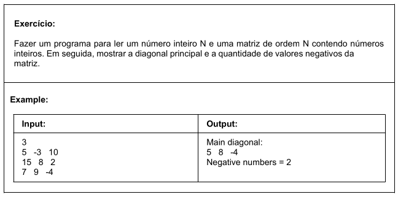
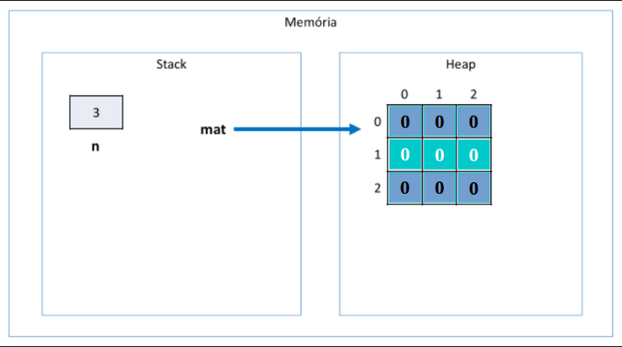
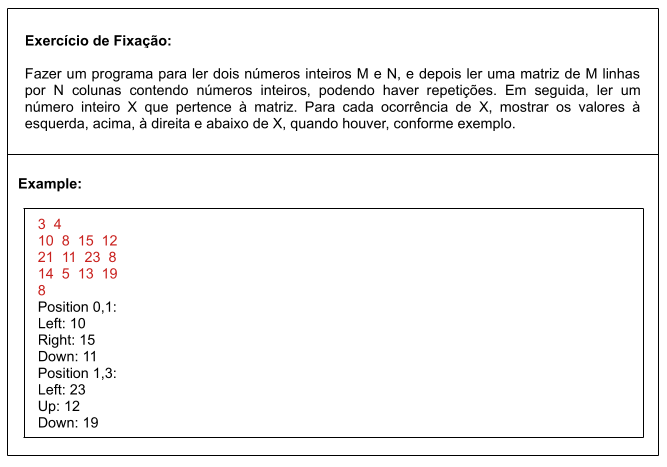

# Aula 109 – Matrizes (Introdução Teórica)

Nesta aula é apresentada uma **revisão conceitual sobre matrizes** em programação.

O objetivo é compreender o que é uma matriz, como ela é estruturada e quais são suas características, preparando o terreno para a próxima aula, onde será mostrado como **declarar, acessar e percorrer matrizes em Java** na prática.

---

## 109.1 Conceito de Matriz

Em programação, uma **matriz** é uma estrutura de dados que representa um **arranjo bidimensional** de elementos.

Enquanto o **vetor** possui apenas **uma dimensão**, a **matriz** possui **duas dimensões**:

- **Linhas**
- **Colunas**

Por esse motivo, uma matriz pode ser entendida como um **vetor de vetores**.

### Exemplo conceitual de matriz:

```
[ 8.0   4.0   5.0 ]
[ 6.0   7.5   3.0 ]
[ 2.0   1.0  11.0 ]
```

Neste exemplo:
- Existem **3 linhas**
- Existem **3 colunas**

Cada linha pode ser vista como um **vetor independente** dentro da estrutura da matriz.

---

## 109.2 Estrutura de Armazenamento

Assim como os vetores, as matrizes possuem algumas **características importantes**.

Uma matriz é:

| Característica | Descrição |
|---|---|
| **Homogênea** | Todos os elementos possuem o mesmo tipo |
| **Ordenada** | Cada elemento possui uma posição específica |
| **Contígua** | Alocada em bloco contíguo de memória |

> Ou seja, quando uma matriz é criada, **todo o espaço necessário** para seus elementos é reservado de uma única vez na memória.

---

## 109.3 Índices de uma Matriz

Cada elemento de uma matriz é identificado por **dois índices**:

```java
matriz[linha][coluna]
```

Por convenção:
- **Primeiro índice** → linha
- **Segundo índice** → coluna

### Exemplo

Considere a matriz:

```
[ 8.0   4.0   5.0 ]
[ 6.0   7.5   3.0 ]
[ 2.0   1.0  11.0 ]
```

O elemento **7.5** está na posição:

```
linha = 1
coluna = 1
```

Logo:

```java
matriz[1][1]
```

O valor **11.0** está na posição:

```
linha = 2
coluna = 2
```

Ou seja:

```java
matriz[2][2]
```

---

## 109.4 Vantagens das Matrizes

As matrizes herdam praticamente as **mesmas vantagens dos vetores**.

- **Acesso direto aos elementos**

É possível acessar qualquer elemento **imediatamente** utilizando sua posição:

```java
matriz[i][j]
```

Isso torna o acesso muito eficiente, pois **não é necessário percorrer a estrutura inteira**.

---

## 109.5 Desvantagens das Matrizes

Assim como os vetores, as matrizes também possuem algumas **limitações**.

**1. Tamanho fixo**

O tamanho da matriz precisa ser **definido no momento da criação**.

```
3 linhas × 3 colunas
```

Se posteriormente for necessário mais espaço, será preciso:
- Criar uma **nova matriz**
- **Copiar** os elementos para ela

**2. Operações de modificação podem ser custosas**

Caso seja necessário:
- Inserir linhas
- Inserir colunas
- Reorganizar elementos

pode ser necessário **deslocar vários valores** dentro da estrutura, o que pode tornar essas operações mais complexas.

---

## 109.6 Relação entre Vetores e Matrizes

Uma forma simples de entender matrizes é pensar nelas como:

```
Matriz = Vetor de Vetores
```

### Exemplo conceitual:

```
matriz[0] → vetor da linha 0
matriz[1] → vetor da linha 1
matriz[2] → vetor da linha 2
```

Cada posição do **primeiro índice** contém um vetor correspondente àquela linha.

---

## 109.7 Conclusão

Nesta aula foi apresentada uma **revisão teórica sobre matrizes**, abordando:

- O conceito de **arranjos bidimensionais**
- A estrutura de **linhas e colunas**
- A forma de **acessar elementos por índices**
- As **vantagens e limitações** dessa estrutura

---

---

# Aula 110 – Matrizes na Prática (Diagonal Principal e Números Negativos)

Exercício prático que demonstra como **declarar, instanciar, ler e percorrer matrizes** em Java.

---

## 110.1 Problema Proposto



---

## 110.2 Declaração e Instanciação

Em Java, uma matriz é declarada com **dois pares de colchetes**:

```java
int[][] mat = new int[n][n];
```

| Parte | Significado |
|---|---|
| `int` | Tipo dos elementos |
| `[][]` | Arranjo bidimensional |
| `n` (1º) | Quantidade de linhas |
| `n` (2º) | Quantidade de colunas |

Todos os elementos são **inicializados com `0`** por padrão (tipo `int`).

### Estrutura na memória (n = 3)



---

## 110.3 Leitura e Percurso da Matriz

Para ler e percorrer a matriz, utilizam-se **dois `for` aninhados** — o externo controla as **linhas** e o interno as **colunas**:

```java
for (int i = 0; i < mat.length; i++) {
    for (int j = 0; j < mat[i].length; j++) {
        mat[i][j] = sc.nextInt();
    }
}
```

O preenchimento ocorre **linha por linha**:

```
mat[0][0] → mat[0][1] → mat[0][2]
mat[1][0] → mat[1][1] → mat[1][2]
mat[2][0] → mat[2][1] → mat[2][2]
```

### 110.1 Propriedade `length`

Em vez de depender da variável `n`, usa-se:

| Expressão | Retorna |
|---|---|
| `mat.length` | Número de linhas |
| `mat[i].length` | Número de colunas da linha `i` |

Isso torna o código **mais flexível e independente** de variáveis externas.

---

## 110.4 Diagonal Principal

A diagonal principal possui a característica: **`linha == coluna`**.

```
mat[0][0]
mat[1][1]
mat[2][2]
```

Basta um único `for` para percorrê-la:

```java
System.out.print("Main diagonal: ");
for (int i = 0; i < mat.length; i++) {
    System.out.print(mat[i][i] + " ");
}
```

---

## 110.5 Contagem de Números Negativos

Percorre-se toda a matriz com dois `for` aninhados, **incrementando um contador** sempre que um valor negativo for encontrado:

```java
int count = 0;

for (int i = 0; i < mat.length; i++) {
    for (int j = 0; j < mat[i].length; j++) {
        if (mat[i][j] < 0) {
            count++;
        }
    }
}

System.out.println("Negative numbers = " + count);
```

---

## 110.6 Código Completo

[Ir para o código](../../../workspace/aula110_exercicio01_matrizes/src/application/Program.java)

---

## 110.7 Conclusão

Neste exercício foram praticados os seguintes conceitos:

- **Declaração e instanciação** de matrizes
- **Leitura** de elementos com `for` aninhado
- **Diagonal principal** — condição `i == j`
- **Contagem condicional** de elementos
- Uso da propriedade **`length`** para percurso genérico

Esses fundamentos são aplicados em áreas como **processamento de imagens**, **jogos** e **algoritmos matemáticos**.

---

---

# Aula 111 - Exercício de Matrizes



**Código com a solução do problema:**

[Ir para o cóigo](../../../workspace/aula111_exercicio_matrizes/src/application/Program.java)