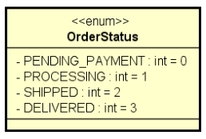

# Aula 127 – Enumerações

---

## 127.1 Definição

Uma **enumeração** (`enum`) é um tipo especial em Java que representa um conjunto **fixo e fechado** de constantes relacionadas. Em vez de usar strings ou inteiros soltos para representar estados ou categorias, o enum garante **tipagem forte** — o compilador rejeita qualquer valor que não pertença ao conjunto definido.

---

## 127.2 Declaração
```java
public enum OrderStatus {
    PENDING_PAYMENT,
    PROCESSING,
    SHIPPED,
    DELIVERED
}
```

Cada valor é implicitamente uma constante `public static final` do tipo `OrderStatus`.  
Por convenção, os nomes são escritos em `UPPER_SNAKE_CASE`.

---

## 127.3 Uso em Classes

O enum pode ser usado como **tipo de atributo**, da mesma forma que `int`, `String` ou qualquer outra classe.

```java
public class Order {

    private Integer id;
    private Date moment;
    private OrderStatus status; // OrderStatus (enum)

    public Order(Integer id, Date moment, OrderStatus status) {
        this.id = id;
        this.moment = moment;
        this.status = status;
    }

    // getters e setter de status
}
```

Para instanciar, o valor é acessado com `NomeDoEnum.CONSTANTE`:

```java
Order order = new Order(1080, new Date(), OrderStatus.PENDING_PAYMENT);
```

O compilador e o autocomplete da IDE só permitem valores válidos do enum, o que **elimina a possibilidade de atribuir um estado inexistente**.

---

## 127.4 Conversão entre String e Enum

Em aplicações reais é comum receber dados como `String` — por exemplo, vindos de uma entrada do usuário ou de um arquivo.

O método estático `valueOf()` realiza essa conversão de **String** para **enum**:

```java
OrderStatus os = OrderStatus.valueOf("DELIVERED"); // String → Enum
```

> O valor passado deve ser **exatamente igual** ao nome declarado no enum — incluindo maiúsculas e minúsculas. Caso contrário, ocorre `IllegalArgumentException` em tempo de execução.

Na direção inversa, ao imprimir um enum, o Java chama `toString()` automaticamente.  
Por padrão, o método `toString()` retorna o nome da constante:

```java
System.out.println(order.getStatus()); // imprime: PENDING_PAYMENT
```

---

## 127.5 Representação em UML

Enums são representados em UML de forma semelhante a uma classe, com o estereótipo `<<enumeration>>`:



Internamente, cada constante possui um **índice inteiro implícito** atribuído na ordem de declaração (`PENDING_PAYMENT = 0`, `PROCESSING = 1`, e assim por diante), acessível pelo método `ordinal()`.

---

## 127.6 Algoritmo completo da aula

- \> _entities_
    - \> _enums_
        - [_OrderStatus.java_](../../../workspace/aula127_enum/src/entities/enums/OrderStatus.java)
    - [_Order.java_](../../../workspace/aula127_enum/src/entities/Order.java)
- \> _application_
    - [_Program.java_](../../../workspace/aula127_enum/src/application/Program.java)