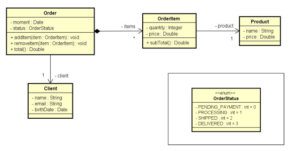

# Aula 128 – Um Pouco sobre Design

Em sistemas orientados a objetos, o foco não está apenas em escrever código que funciona, mas em **como organizar as classes** de forma que o sistema seja legível, reutilizável e fácil de manter.

---

## 128.1 Categorias de Classes

Para organizar melhor um sistema, as classes podem ser divididas em categorias de acordo com sua responsabilidade:

| Categoria | Responsabilidade |
|---|---|
| **View** | Interface com o usuário — entrada e saída de dados |
| **Controller** | Comunica View e lógica do sistema, coordena o fluxo |
| **Entities** | Representam os dados do domínio (`Product`, `Client`, `Order`) |
| **Services** | Contêm as regras de negócio e executam operações do sistema |
| **Repositories** | Acesso e persistência de dados (`save`, `findById`, `delete`) |

---

## 128.2 Foco Inicial do Curso: Entidades

Nos próximos exemplos, o foco será nas **entidades de negócio** — classes que representam os dados do domínio e os relacionamentos entre eles.

Um sistema de pedidos, por exemplo, pode ser modelado com as seguintes entidades:

- `Order` possui um `Client` e vários `OrderItem`
- Cada `OrderItem` está associado a um `Product`

Esse tipo de modelagem representa o **domínio do problema** e é a base para aplicar **composição** de objetos.

---

## 128.3 Camada de Serviços

Além das entidades, sistemas reais utilizam serviços para executar operações. Serviços podem depender de outros serviços, promovendo **reutilização** e **separação de responsabilidades**:

- `OrderService` — salva e busca pedidos; usa `OrderRepository` e `EmailService`
- `OrderRepository` — acessa o banco de dados (`save`, `delete`, `findById`, `findAll`)
- `EmailService` — envia e-mails; pode ser usado por outros serviços como `AuthService`

Esse modelo de dependência entre serviços é a base para arquiteturas mais robustas, que serão exploradas nas próximas seções do curso.

---