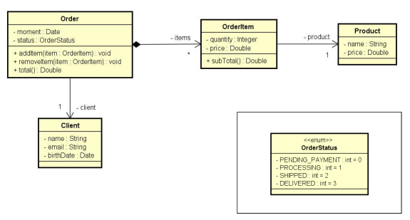

# Aula 129 – Composição

**Composição** é um tipo de associação onde um objeto é formado por outros objetos. É um dos relacionamentos mais importantes na POO porque permite modelar sistemas reais de forma natural — representando relações do tipo **"tem um"** (`has-a`) ou **"tem vários"** (`has-many`).

---

## 129.1 Composição vs. Associação Simples no UML

Na prática, nem toda relação "tem um" é igual. É importante distinguir dois casos:

### 129.1.1 Relação todo-parte (composição forte)

O objeto contido é uma *parte estrutural* do objeto que o contém — sem o todo, a parte não faz sentido de existir de forma independente. Na **UML**, é representada por um **diamante preto (◆)**.

```
Order ◆───>* OrderItem
```

> Um `OrderItem` é parte estrutural de um `Order`. Fora do pedido, o item não tem razão de existir isoladamente.

### 129.1.2 Associação simples

Os objetos estão relacionados, mas um não é *parte* do outro — existem de forma independente. Na UML, é representada por uma **seta simples (→)**.

```
Order ───> Client
```

> Um `Client` não é parte do pedido — ele existe de forma independente e pode estar associado a vários pedidos.

### 129.1.3 Composição no Java

Em **código Java**, o termo **"composição"** é frequentemente usado de forma mais ampla para qualquer relação **"tem um"** ou **"tem vários"**, mesmo que não seja composição forte no sentido estrito da UML.

---

## 129.2 Exemplo: Modelo de Pedido

O modelo abaixo ilustra como composição e associação se combinam em um sistema real:

| Relação | Tipo | Interpretação |
|---|---|---|
| `Order` → `OrderItem` | Composição | O item é parte estrutural do pedido |
| `Order` → `Client` | Associação | O cliente existe independente do pedido |
| `OrderItem` → `Product` | Associação | O produto existe independente do item |



---

## 129.3 Composição entre Serviços

A composição não se limita a entidades — ela também ocorre entre **serviços**,
promovendo reutilização e separação de responsabilidades:

- `OrderService` depende de `OrderRepository` (acesso a dados) e `EmailService` (notificações)
- `AuthService` também pode depender de `EmailService`

O fato de `EmailService` ser reutilizado por diferentes serviços sem precisar ser duplicado é um dos principais benefícios da composição na camada de serviços.

---

## 129.4 Vantagens da Composição

- **Coesão** — cada classe tem uma responsabilidade bem definida, evitando classes
"faz-tudo"
- **Flexibilidade** — partes do sistema podem evoluir de forma independente
- **Reutilização** — um mesmo objeto (ex: `Product`) pode compor diferentes estruturas
- **Manutenção** — sistemas compostos são mais fáceis de modificar e testar

> 💡 *Prefira composição ao invés de herança sempre que possível.* Esse princípio, amplamente adotado no mercado, será explorado com mais profundidade ao longo do curso.

---